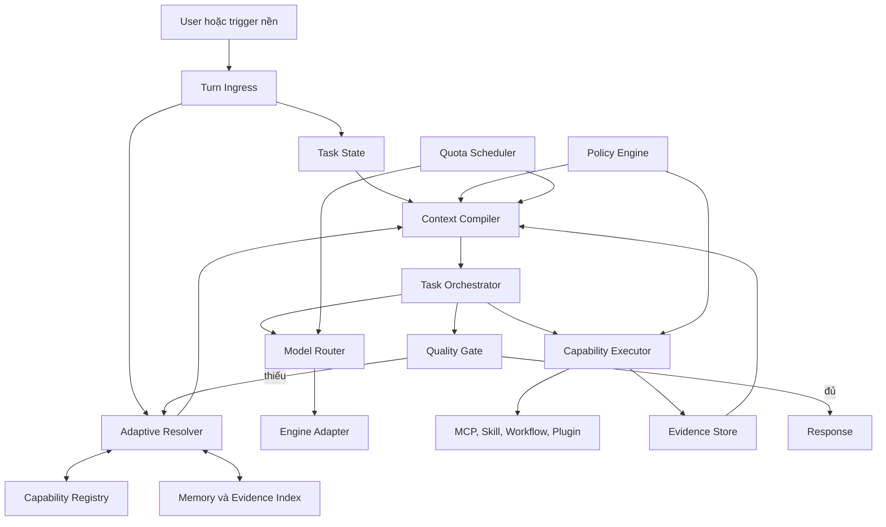
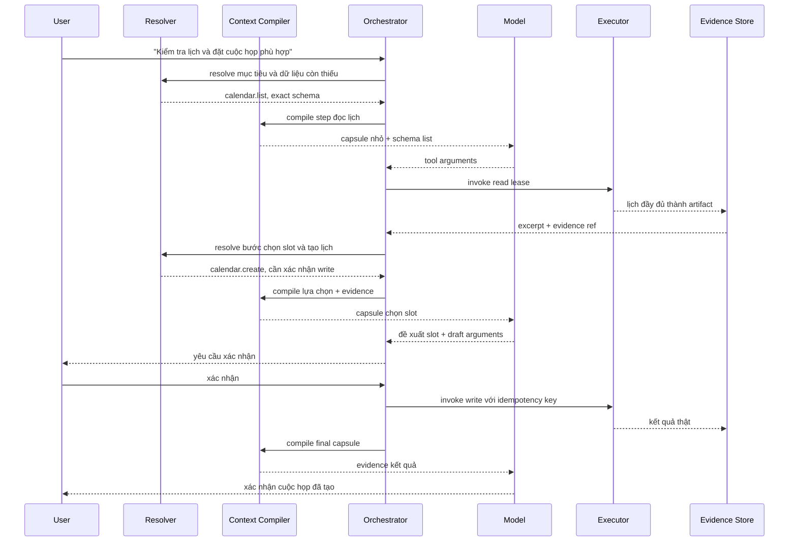

# Adaptive Context Runtime cho Javis OS

Ngày: 2026-08-01
Trạng thái: **Phase 0-4 chạy `shadow`; code Phase 5 đã hoàn tất nhưng canary production đang tắt**
Phạm vi: dashboard, Telegram, các engine API, Claude/Codex CLI, task nền, workflow và MCP Hub

Bản sửa lộ trình: 2026-08-01. Task State tối thiểu, bảo mật trace và quota ledger được đưa lên đầu; multi-round read-only, tool write, workflow, agent và model routing được tách thành các phase độc lập.

Tiến độ triển khai ngày 2026-08-01:

- Đã có `task_id`/`step_id`, event envelope, SQLite `runtime.db`, revision pinning, optimistic version guard, budget/deadline envelope, evidence ref chỉ lưu hash và quota reservation observe-only.
- Đã gắn trace chung vào dashboard và Telegram cho API, Claude CLI và Codex CLI mà không đổi prompt, model, tool list hay dispatch.
- Token attribution chỉ lưu số đo kích thước; raw prompt, message, tool arguments/result, secret và source ref không được ghi vào runtime store.
- Đã có synthetic gold fixture, prompt-contract baseline và regression tests cho lifecycle, privacy, multi-round usage, quota reconciliation và version conflict.
- Đã có Capability Registry SQLite dẫn xuất theo từng brain/source, FTS5, schema hash, stable ID/revision, ModelProfile, integrity check và tự quarantine/rebuild khi database hỏng.
- Resolver deterministic đã có hard filter cho brain, health, source, permission và side effect; sau đó mới chấm alias/FTS/coverage và dynamic cutoff. Embedding chỉ là adapter đo recall bổ sung.
- Registry refresh và Resolver chạy background bằng thread, chỉ ghi `resolver.shadow` đã redaction vào task trace; không thay tool list gửi model.
- Benchmark synthetic cục bộ với 5.000 capability: rebuild khoảng 2,7 giây ở background; resolve median khoảng 8,4 ms và p95 khoảng 12,6 ms sau khi cache revision.
- Context Compiler shadow đã có `ContextItem`, budget theo ModelProfile/adapter, renderer và tokenizer adapter thay thế được, quota preflight observe-only, source map/hash và giải thích capability được chọn/loại.
- Core contract shadow không nhúng toàn bộ MEMORY, skill index hay capability catalog; memory và history production vẫn do legacy quản lý trong Phase 4.
- Deterministic Quality Gate ghi baseline trên output legacy của Dashboard và Telegram, không sửa hoặc chặn câu trả lời.
- Benchmark synthetic cục bộ với Registry 5.000 capability và một capability được chọn: capsule 415 token, compile median khoảng 1,0 ms và p95 khoảng 1,6 ms.
- Fast Path Phase 5 đã có classifier bảo thủ, stable session hash, task path pinning, registry freshness/revision gate, hard-quota profile versioned, rolling-window admission atomic và direct API stream đúng một model call.
- Fast Path không đọc legacy system prompt, MEMORY, history hoặc tool schema. Request tool/live-data/side-effect/memory/attachment/không chắc chắn vẫn đi legacy trước model call.
- Benchmark local 250 task chat-thuần gồm resolve + compile + pin + SQLite quota admission: median 5,4 ms, p95 7,8 ms, capsule median 401 token; giảm khoảng 97% so với riêng `CLAUDE.md + MEMORY.md` theo cùng estimator, chưa tính history và tool schema legacy.
- Cấu hình mặc định vẫn là `mode=shadow`, `allocation_basis_points=0` và không có quota profile. Vì vậy merge code Phase 5 không tự chuyển bất kỳ người dùng thật nào sang đường mới.
- Phase 0, Phase 3 và Phase 4 chỉ được coi là **qua release gate** sau khi có đủ mẫu production đã redaction, đối chiếu usage/tokenizer thật và owner duyệt baseline/miss critical. Vì vậy Phase 5 chưa được phép ảnh hưởng request thật.

## 0. Quyết định kiến trúc

Javis sẽ chuyển từ cách dựng request theo kiểu "nối mọi thứ có thể hữu ích vào prompt" sang một runtime biên dịch context theo từng bước của nhiệm vụ.

Mục tiêu bất biến là:

> Số capability có thể tăng từ vài chục lên hàng chục nghìn nhưng context của một bước chỉ tăng theo số capability thật sự cần cho bước đó.

Capability trong tài liệu này bao gồm MCP tool, builtin tool, plugin tool, skill, workflow, agent, model, nguồn memory, nguồn evidence và validator.

Runtime mới không xoá các nguồn dữ liệu hiện tại và không biến vector database thành nguồn sự thật. Registry, index, embedding, summary và working state đều là dữ liệu dẫn xuất, có thể dựng lại từ nguồn gốc.

Không triển khai bằng một lần viết lại lớn. Runtime mới phải chạy song song với đường hiện tại, có shadow mode, canary mode và fallback theo từng lượt.

## 1. Bối cảnh và số đo hiện tại

Đo trên brain `brains/My Bullet Journal` ngày 2026-08-01:

| Thành phần | Kích thước ký tự |
|---|---:|
| `CLAUDE.md` gốc của Javis | 21.479 |
| `Memory/MEMORY.md` được nạp | 18.723 |
| Khối capability và skill router | khoảng 4.600 |
| System prompt hoàn chỉnh | 45.625 |
| 26 schema tool gửi qua API | 17.161 |
| Tổng cố định trước lịch sử và câu hỏi | khoảng 62.800 |

Với tokenizer của từng model, payload trên có thể vượt 12.000 token trước khi model sinh câu trả lời. Việc thêm memory, skill, plugin hoặc MCP hiện có thể làm chi phí context tăng tuyến tính.

Các điểm ghép hiện tại:

- `server/main.py:266` dựng system prompt từ luật gốc, memory, capability và skill.
- `server/main.py:5481` dựng prompt cho dashboard.
- `server/main.py:5587` ghép lịch sử API qua compaction.
- `server/main.py:5590` chuyển request sang MCP/tool loop.
- `server/mcp_hub.py:610` discover toàn bộ tool.
- `server/engine.py:1077` đưa messages và tool schema vào payload provider.
- `server/compaction.py:100` quản lý phần lịch sử đã và chưa nén.

Các phần có thể tái sử dụng:

- MCP Hub đã chuẩn hoá route, permission và lazy discovery cho connector.
- `compaction.py` đã có summary cuộn và fallback.
- `engine.py` đã có adapter provider và tool loop.
- Skill, workflow, plugin và model đã có metadata ban đầu.
- SQLite, FTS5, usage store và session store đã tồn tại trong hệ thống.

## 2. Mục tiêu

### 2.1 Mục tiêu chức năng

1. Giữ nguyên toàn bộ năng lực hiện có của Javis.
2. Thêm MCP, skill, workflow, agent hoặc model mà không phải sửa system prompt trung tâm.
3. Context ban đầu không chứa danh sách đầy đủ capability.
4. Mỗi bước chỉ nhận schema chính xác của capability được chọn cho bước đó.
5. Nhiệm vụ đơn giản vẫn trả lời trong một model call.
6. Nhiệm vụ phức tạp được phép resolve, execute và replan qua nhiều vòng.
7. Memory đầy đủ vẫn được lưu, nhưng model chỉ nhận evidence liên quan.
8. Mọi hành động có side effect phải có policy, audit và chống chạy trùng.
9. Có thể đổi model theo từng bước mà không làm mất trạng thái nhiệm vụ.
10. Mọi quyết định chọn context, capability và model đều truy vết được.

### 2.2 Mục tiêu hiệu năng

1. Chi phí context tăng theo `k`, là số capability được dùng trong bước hiện tại, không tăng theo tổng số capability `N`.
2. Resolver thông thường chạy local, không cần gọi LLM.
3. Fast path không thêm model round so với hiện tại.
4. Read-only tool độc lập có thể chạy song song.
5. Tổng token của toàn task được tối ưu, không chỉ token của request đầu tiên.
6. Hệ thống theo dõi TPM, RPM, concurrency, chi phí và output reserve theo thời gian thực.

### 2.3 Mục tiêu chất lượng

1. Không giảm khả năng tìm đúng tool, skill, workflow hoặc memory.
2. Khi resolver không chắc chắn, hệ thống phải mở rộng truy xuất hoặc fallback, không tự tin bỏ sót.
3. Fact quan trọng trong câu trả lời phải có provenance nội bộ.
4. Tool arguments phải được validate bằng schema thật trước khi chạy.
5. Model không được quyết định quyền hoặc vượt policy bằng nội dung prompt.

## 3. Không phải mục tiêu

- Không thay toàn bộ database hiện tại bằng vector database.
- Không chuyển memory gốc sang một định dạng độc quyền.
- Không ép mọi câu hỏi đi qua agent loop nhiều vòng.
- Không tạo một bản prompt riêng được hardcode cho từng provider.
- Không loại bỏ Claude/Codex native session.
- Không gộp ngay toàn bộ dashboard, Telegram, task nền và workflow vào một lần refactor.
- Không cho LLM tự quyết định quyền, quota hoặc side effect.
- Không xoá fallback hiện tại trước khi replay benchmark đạt yêu cầu.

## 4. Các nguyên tắc bất biến

### 4.1 Context phải có kích thước cấu trúc gần như cố định

Core prompt chỉ mô tả giao thức làm việc, danh tính tối thiểu và các ràng buộc cần cho bước hiện tại. Nó không liệt kê toàn bộ memory, skill, workflow hay tool.

Thêm 1.000 capability mới vào Registry không được tự động thêm 1.000 dòng vào prompt.

### 4.2 Nguồn sự thật ở ngoài model

- File memory, skill và workflow là nguồn sự thật nội dung.
- MCP server là nguồn sự thật schema tool.
- Settings và model catalog là nguồn sự thật cấu hình provider.
- Registry và index chỉ là bản dẫn xuất.
- Task state và evidence phải tồn tại ngoài context của model.

### 4.3 Exact schema at execution time

Model chỉ được sinh arguments cho schema đầy đủ đã được chọn và đưa vào capsule của bước hiện tại. Không yêu cầu model đoán tham số từ tên tool hoặc mô tả rút gọn.

### 4.4 Enforcement ở gateway

Permission, confirmation, rate limit, path scope, idempotency và side-effect policy phải được thực thi bằng code. Prompt chỉ giúp model hành xử tốt, không phải hàng rào an toàn cuối cùng.

### 4.5 Adaptive thay vì hardcode số lượng

Không dùng một con số cố định kiểu "luôn lấy 5 memory", "luôn giữ 12 message" hoặc "luôn phơi 8 tool" làm logic chính.

Runtime chọn số lượng dựa trên:

- ngân sách token còn lại;
- độ tin cậy của retrieval;
- độ chênh điểm giữa ứng viên;
- mức độ phủ mục tiêu;
- độ rủi ro của hành động;
- giá trị thông tin dự kiến;
- chi phí và độ trễ hiện tại.

Các giới hạn tuyệt đối chỉ là safety ceiling cấu hình được, không phải thuật toán chọn context.

## 5. Thuật ngữ

| Thuật ngữ | Nghĩa |
|---|---|
| Capability | Một năng lực có thể discover, describe hoặc invoke |
| Manifest | Metadata chuẩn hoá của capability |
| Registry | Kho manifest và version, không nằm trong prompt |
| Resolver | Thành phần tìm capability phù hợp với mục tiêu |
| Context item | Một đơn vị nội dung có nguồn, điểm giá trị và chi phí token |
| Context capsule | Context đã biên dịch cho đúng một bước |
| Task | Mục tiêu xuyên suốt một hoặc nhiều vòng |
| Step | Một lần suy luận hoặc thực thi trong task |
| Evidence | Dữ liệu có nguồn do memory, file hoặc tool cung cấp |
| Artifact | Kết quả đầy đủ lưu ngoài prompt, được tham chiếu bằng ID |
| Quality gate | Bộ đánh giá task đã đủ bằng chứng để trả lời hay chưa |
| Shadow mode | Runtime mới tính quyết định nhưng đường cũ vẫn thực thi |

## 6. Kiến trúc tổng thể



## 7. Capability Registry

### 7.1 Vai trò

Registry cung cấp một giao diện thống nhất cho:

- MCP tool từ mọi connection;
- builtin tool trong Javis;
- plugin tool;
- skill;
- workflow và agent;
- model/provider;
- memory collection;
- validator và transformer.

Registry không được nối toàn bộ manifest vào system prompt.

Phạm vi dài hạn của Registry là tất cả các loại trên. MVP chỉ ingest MCP tool, builtin tool, plugin tool và ModelProfile tối thiểu. Skill, workflow, agent và memory collection được đưa vào sau khi đường tool đã chứng minh hoạt động. Cách chia này tránh thiết kế một manifest phổ quát quá sớm mà chưa có consumer thật.

### 7.2 Capability manifest

Schema logic phiên bản đầu:

```python
@dataclass(frozen=True)
class CapabilityManifest:
    id: str
    revision: str
    kind: str
    name: str
    summary: str
    intents: list[str]
    aliases: list[str]
    input_schema: dict
    output_schema: dict | None
    permissions: list[str]
    side_effect: str
    risk: str
    provider: str | None
    dependencies: list[str]
    constraints: dict
    cost_hint: dict
    latency_hint: dict
    cache_policy: dict
    health: dict
    examples: list[dict]
    source_ref: str
    source_hash: str
    metadata: dict
```

Quy ước:

- `id` ổn định, có namespace, ví dụ `mcp.google-calendar.create-event`.
- `revision` thay đổi khi schema hoặc hành vi thay đổi.
- `side_effect` thuộc nhóm `none`, `read`, `write`, `dangerous`.
- `source_ref` chỉ tới MCP connection, file skill, workflow hoặc adapter model gốc.
- `source_hash` dùng invalidation và replay.
- Manifest không chứa secret.

### 7.3 Storage

Dùng SQLite trong `JAVIS_STATE_DIR`, ví dụ `capabilities.db`:

```sql
CREATE TABLE capabilities (
    id TEXT PRIMARY KEY,
    revision TEXT NOT NULL,
    kind TEXT NOT NULL,
    manifest_json TEXT NOT NULL,
    source_ref TEXT NOT NULL,
    source_hash TEXT NOT NULL,
    enabled INTEGER NOT NULL,
    updated_at REAL NOT NULL
);

CREATE TABLE capability_aliases (
    capability_id TEXT NOT NULL,
    alias TEXT NOT NULL
);

CREATE TABLE capability_dependencies (
    capability_id TEXT NOT NULL,
    dependency_id TEXT NOT NULL,
    relation TEXT NOT NULL
);

CREATE TABLE capability_stats (
    capability_id TEXT PRIMARY KEY,
    success_count INTEGER NOT NULL,
    failure_count INTEGER NOT NULL,
    latency_ema REAL,
    last_error TEXT,
    last_used_at REAL
);
```

FTS5 index dùng cho name, summary, intent, alias và ví dụ. Embedding index là adapter tuỳ chọn, không phải điều kiện boot.

### 7.4 Ingestion adapter

Mỗi nguồn triển khai một adapter:

```python
class CapabilitySource(Protocol):
    async def snapshot(self) -> SourceSnapshot: ...
    async def manifests(self, snapshot: SourceSnapshot) -> AsyncIterator[CapabilityManifest]: ...
```

Nguồn tối thiểu:

- `MCPSource`: chuyển kết quả `tools/list` thành manifest.
- `BuiltinSource`: đăng ký builtin tool và policy.
- `PluginSource`: đọc plugin manifest và tool registration.
- `SkillSource`: đọc frontmatter và source path, không đọc toàn thân skill vào Registry.
- `WorkflowSource`: đọc input, output, trigger và dependency.
- `ModelSource`: đọc catalog model và capability provider.
- `MemorySource`: đăng ký collection, không biến từng fact thành tool.

Thứ tự triển khai source adapter:

1. MCP, builtin và plugin tool.
2. ModelProfile tối thiểu để compiler và quota preflight dùng.
3. Skill và memory collection sau khi read-only tool path ổn định.
4. Workflow và agent sau khi Task Orchestrator có checkpoint/resume.

### 7.5 Đồng bộ và invalidation

- Registry được cập nhật nền khi source hash đổi.
- Request chat không chờ full rescan nếu đang có snapshot hợp lệ.
- Nếu source lỗi, giữ revision tốt gần nhất và đánh dấu degraded.
- Nếu Registry hỏng, có thể xoá database dẫn xuất và dựng lại.
- Việc thay đổi một source chỉ invalidation capability thuộc source đó.

### 7.6 Điểm mở rộng

Lõi không import trực tiếp từng connector, model hoặc workflow mới. Extension đăng ký qua giao diện:

```python
@dataclass
class RuntimeExtension:
    name: str
    version: str
    sources: list[CapabilitySource]
    executors: dict[str, CapabilityExecutor]
    model_adapters: list[ModelEngine]
    context_sources: list[ContextSource]
    policy_providers: list[PolicyProvider]
    validators: list[QualityValidator]
```

Quy tắc đăng ký:

- Mỗi extension có namespace riêng.
- Trùng capability ID là lỗi, không cho extension mới shadow im lặng.
- Extension có thể thêm kind mới nhưng phải khai báo renderer và executor tương ứng.
- Extension không được ghi thẳng vào Registry database; chỉ phát manifest qua source adapter.
- Extension unload làm capability chuyển disabled/degraded, không xoá audit hoặc task history.
- Runtime extension API có version; không dùng import side effect làm hợp đồng ngầm.

Thêm MCP mới chỉ cần connection và `tools/list`. Thêm model mới chỉ cần ModelProfile source và engine adapter. Thêm workflow mới chỉ cần manifest và graph source. Không trường hợp nào yêu cầu sửa core prompt.

## 8. Adaptive Resolver

### 8.1 Input và output

```python
@dataclass
class ResolveRequest:
    task_id: str
    objective: str
    active_state: dict
    available_inputs: list[DataRef]
    required_outputs: list[DataContract]
    channel: str
    brain: str
    actor: ActorContext
    model_profile: ModelProfile | None
    policy_context: dict

@dataclass
class ResolveResult:
    candidates: list[ResolvedCapability]
    coverage: dict
    confidence: float
    unresolved: list[str]
    recommended_path: str
    trace_id: str
```

`recommended_path` có thể là `fast`, `tool`, `workflow`, `agentic`, `ask_user` hoặc `fallback_legacy`.

### 8.2 Pipeline tìm kiếm

1. Phân rã objective thành nhu cầu dữ liệu và hành động.
2. Hard filter theo enabled, permission, channel, brain, dependency và health.
3. Lấy ứng viên bằng FTS, alias, semantic index và dependency graph.
4. Boost capability từng chạy thành công với intent tương tự.
5. Penalize capability lỗi, chậm, tốn quota hoặc yêu cầu quyền chưa có.
6. Tính coverage của toàn bộ objective, không chỉ điểm từng tool.
7. Chọn tập ứng viên bằng marginal utility thay vì top-k cố định.

Điểm khái niệm:

```text
utility = relevance
        × confidence
        × health
        × permission_fit
        × output_fit
        × freshness
        - latency_cost
        - token_cost
        - monetary_cost
        - risk_cost
```

Các trọng số thuộc `ResolverPolicy`, có version và có thể thay đổi mà không sửa manifest.

Resolver phiên bản đầu phải deterministic và giải thích được. Nó dùng hard filter, alias, FTS, coverage và score gap. Embedding chỉ bổ sung recall khi FTS chưa đủ. Chưa tự học trọng số online và chưa boost mạnh theo số lần capability từng được chọn, vì cơ chế đó dễ tạo vòng lặp phổ biến khiến capability mới không có cơ hội xuất hiện.

### 8.3 Dynamic cutoff

Resolver dừng thêm ứng viên khi thoả tất cả điều kiện:

- các nhu cầu bắt buộc đã được phủ;
- ứng viên kế tiếp không tăng coverage đáng kể;
- độ chênh điểm cho thấy lựa chọn đã rõ;
- token cost của schema kế tiếp lớn hơn giá trị dự kiến;
- confidence đạt mức yêu cầu theo risk class.

Khi confidence thấp:

- mở rộng query bằng alias hoặc graph neighbor;
- tìm workflow thay vì tool đơn;
- hỏi model planner bằng capsule nhỏ;
- hỏi lại người dùng nếu có nhiều hành động write khác nhau;
- fallback về đường hiện tại hoặc model có ngân sách lớn hơn.

### 8.4 Shadow mode

Trong shadow mode:

- Resolver ghi candidates và confidence.
- Đường hiện tại vẫn nhận full prompt/tool như cũ.
- Sau lượt, trace so sánh tool thực sự được gọi với candidates.
- Không có quyết định shadow nào được chạy tool hoặc thay câu trả lời.

Shadow replay là cổng bắt buộc trước canary, nhưng hành vi cũ không được coi là nhãn đúng duy nhất. Đánh giá cần hai tập:

- Replay tự động để phát hiện khác biệt với đường hiện tại.
- Gold benchmark do người duyệt đánh dấu capability, evidence và kết quả đúng.

Nếu Resolver mới chọn workflow hoặc capability tốt hơn đường cũ, benchmark phải ghi nhận là cải thiện thay vì mismatch.

## 9. Model Registry và Quota Scheduler

### 9.1 Model profile

```python
@dataclass(frozen=True)
class ModelProfile:
    provider: str
    model: str
    context_window: int | None
    input_tpm: int | None
    output_tpm: int | None
    rpm: int | None
    supports_tools: bool
    supports_parallel_tools: bool
    supports_vision: bool
    supports_reasoning: bool
    supports_prompt_cache: bool
    tokenizer: str | None
    pricing: dict
    reliability: dict
```

Profile được hợp nhất từ:

- catalog mặc định có version;
- metadata live của provider nếu có;
- override của người dùng;
- usage và error quan sát được.

Không tin tuyệt đối một nguồn. Mọi field có provenance và thời điểm cập nhật.

### 9.2 Quota snapshot

Quota Scheduler duy trì cửa sổ trượt theo actor, provider và model:

```python
@dataclass
class QuotaSnapshot:
    input_tokens_used: int
    output_tokens_used: int
    requests_used: int
    inflight_reserved_tokens: int
    reset_at: float | None
    confidence: float
```

Trước khi gửi request:

1. Tokenizer adapter đếm request dự kiến.
2. Nếu chưa có tokenizer chính xác, estimator dùng sai số đã học từ usage thật và safety margin.
3. Scheduler reserve token atomically.
4. Khi provider trả usage, reservation được reconcile.
5. Khi lỗi trước generation, reservation được giải phóng theo policy provider.

### 9.3 Model routing

Model Router chọn model theo từng step dựa trên:

- output contract;
- tool/vision/reasoning requirement;
- context và quota còn lại;
- deadline và latency;
- risk và quality requirement;
- chi phí task còn lại;
- reliability live.

Không đổi model chỉ để tiết kiệm nếu việc đổi làm mất năng lực cần thiết.

## 10. Context Compiler

### 10.1 Context item

Mọi nội dung có thể đi vào prompt phải được chuẩn hoá:

```python
@dataclass(frozen=True)
class ContextItem:
    id: str
    kind: str
    content: str
    source_ref: str
    token_cost: int
    relevance: float
    confidence: float
    authority: float
    freshness: float
    required: bool
    trust: str
    scope: dict
    conflicts_with: list[str]
    metadata: dict
```

Các `kind` ban đầu:

- `core_contract`;
- `policy_clause`;
- `identity_fact`;
- `memory_fact`;
- `conversation_state`;
- `recent_turn`;
- `evidence_excerpt`;
- `capability_schema`;
- `workflow_contract`;
- `channel_context`;
- `user_attachment`;
- `output_contract`.

### 10.2 Budget

```python
@dataclass
class ContextBudget:
    max_input_tokens: int
    reserved_output_tokens: int
    task_tokens_remaining: int
    rolling_tpm_remaining: int | None
    latency_deadline_ms: int | None
    monetary_remaining: float | None
```

`max_input_tokens` được tính từ model profile, quota snapshot, task budget và output reserve. Nó không nằm trong một hằng số chung cho mọi model.

### 10.3 Thuật toán compile

1. Nạp các item bắt buộc nhỏ nhất: objective, output contract, policy áp dụng và active state.
2. Loại item sai brain, sai actor, hết hạn hoặc không đủ trust.
3. Hợp nhất item trùng theo source hash.
4. Phát hiện conflict và giữ cả hai nếu conflict chưa được giải quyết.
5. Chọn item có utility/token cao cho tới khi coverage đủ hoặc marginal utility không còn hợp lý.
6. Nếu item bắt buộc làm vượt budget, không cắt âm thầm. Trả quyết định `recompile`, `change_model`, `defer`, `ask_user` hoặc `fallback`.
7. Render capsule theo adapter của model.
8. Đếm token lần cuối trên payload đã render, gồm cả tool schema.

Pseudo-code:

```python
def compile_context(request, items, budget, policy):
    chosen = select_required(items, request)
    if token_cost(chosen) > budget.max_input_tokens:
        return CompileFailure.required_items_too_large(chosen)

    pool = normalize_filter_dedupe(items, request, policy)
    while not coverage_sufficient(chosen, request):
        candidate = best_marginal_candidate(pool, chosen, budget, policy)
        if candidate is None:
            break
        chosen.append(candidate)
        pool.remove(candidate)

    capsule = render_capsule(chosen, request)
    return verify_and_finalize(capsule, budget)
```

### 10.4 Context capsule

```python
@dataclass
class ContextCapsule:
    task_id: str
    step_id: str
    objective: str
    active_state: dict
    instructions: list[str]
    evidence: list[EvidenceExcerpt]
    capabilities: list[CapabilityLease]
    constraints: list[Constraint]
    output_contract: dict
    source_map: dict
    budget: ContextBudget
    capsule_hash: str
```

Capsule phải có `source_map` để trace biết câu nào đến từ đâu. Không đưa `source_map` dài vào model nếu adapter không cần, nhưng phải lưu ngoài prompt.

### 10.5 Core contract

Core contract chỉ chứa:

- danh tính và cách giao tiếp tối thiểu;
- quy tắc tuân theo capsule;
- quy tắc không bịa tool/evidence;
- cách báo thiếu dữ liệu;
- hợp đồng trả output;
- chỉ dẫn rằng quyền và side effect do gateway kiểm soát.

Luật chi tiết được tách thành policy clause và chỉ nạp khi scope khớp. Các luật bắt buộc ở mọi nơi phải được enforcement bằng code nếu có thể.

## 11. Memory và Conversation State

### 11.1 Bốn lớp memory

1. `Event store`: hội thoại, tool event, file event và quyết định gốc.
2. `Fact store`: fact đã chưng cất, có source, confidence và thời gian.
3. `Relationship index`: liên kết người, dự án, file, task và fact.
4. `Working state`: mục tiêu, giả định, quyết định và việc dang dở của task hiện tại.

`MEMORY.md` tiếp tục tồn tại trong giai đoạn chuyển tiếp và vẫn là nguồn người dùng đọc được. Runtime mới không dựa vào việc nhúng toàn file.

### 11.2 Memory record

```python
@dataclass
class MemoryRecord:
    id: str
    title: str
    content_ref: str
    excerpt: str
    topics: list[str]
    entities: list[str]
    valid_from: float | None
    valid_to: float | None
    confidence: float
    importance: float
    source_refs: list[str]
    source_hash: str
```

### 11.3 Retrieval cascade

1. Active working state của task.
2. Identity/core facts có scope phù hợp.
3. Exact keyword và entity match.
4. FTS và semantic retrieval.
5. Graph expansion khi thiếu coverage.
6. Đọc file nguồn khi cần chi tiết hoặc có conflict.

Số record được chọn theo coverage và budget, không theo một top-k cố định.

### 11.4 Lịch sử hội thoại

Không dùng một summary văn xuôi làm nguồn duy nhất. Session cần ba dạng dữ liệu:

- transcript gốc trong `conversations.db`;
- structured conversation state;
- summary dẫn xuất để đọc nhanh.

Structured state tối thiểu:

```json
{
  "goals": [],
  "decisions": [],
  "open_questions": [],
  "constraints": [],
  "artifacts": [],
  "entities": [],
  "last_completed_step": null
}
```

Khi compiler cần chi tiết bị thiếu trong state, nó có thể truy ngược transcript bằng source ref.

## 12. Evidence Store

### 12.1 Mục đích

Tool result, file content và dữ liệu lớn được lưu ngoài prompt. Model chỉ nhận excerpt phù hợp và artifact ID.

Ví dụ:

```text
evidence://task/01J4.../step/03/google-calendar-events
```

### 12.2 Evidence object

```python
@dataclass
class Evidence:
    id: str
    task_id: str
    step_id: str
    source_type: str
    source_ref: str
    content_type: str
    artifact_path: str | None
    inline_excerpt: str
    content_hash: str
    trust: str
    created_at: float
    expires_at: float | None
    metadata: dict
```

### 12.3 Quy tắc

- Full result được lưu nguyên hoặc chuẩn hoá thành artifact.
- Secret phải được redaction trước khi index hoặc trace.
- Excerpt phải giữ source location, row, page hoặc JSON path nếu có.
- Evidence read-only có thể cache theo manifest policy và input hash.
- Evidence write response không được dùng cache để giả định hành động đã chạy.
- Artifact lớn phải có pagination hoặc query interface.

## 13. Task Orchestrator

### 13.1 Task state machine

```text
CREATED
  -> RESOLVING
  -> COMPILING
  -> MODEL_RUNNING hoặc EXECUTING
  -> EVALUATING
  -> COMPLETED
  -> WAITING_USER
  -> RETRYABLE_ERROR
  -> FAILED
  -> CANCELLED
```

Mỗi state transition được lưu atomically và phát event có `task_id`, `step_id`, `attempt`.

### 13.2 Task state

```python
@dataclass
class TaskState:
    task_id: str
    session_id: str
    brain: str
    channel: str
    actor: ActorContext
    objective: str
    status: str
    active_state: dict
    evidence_refs: list[str]
    capability_leases: list[str]
    token_budget: dict
    quota_reservations: list[str]
    steps: list[StepRef]
    version: int
    runtime_version: str
    resolver_policy_version: str
    compiler_policy_version: str
    registry_revision: str
    model_profile_revision: str
    created_at: float
    updated_at: float
```

`version` dùng optimistic concurrency control. Step hoàn thành trên state version cũ không được đè state mới. Năm trường revision được ghim khi tạo task; task không tự nhảy sang runtime, policy, Registry hoặc model metadata mới giữa chừng.

### 13.3 Ba execution path

#### Fast path

Áp dụng khi không cần dữ liệu live, không có side effect và Context Compiler đã đủ evidence.

```text
resolve local -> compile -> một model call -> quality gate -> response
```

#### Tool path

Áp dụng khi cần một nhóm capability rõ ràng.

```text
resolve local -> compile exact schemas -> model tool call
-> validate -> execute -> evidence -> compile final -> response
```

Nếu objective và arguments có thể được xác định an toàn bằng gateway, có thể execute trước model và chỉ dùng model để tổng hợp.

#### Agentic path

Áp dụng khi objective nhiều bước, có dependency hoặc resolver chưa đủ coverage.

```text
plan -> resolve step -> compile -> execute -> evidence
-> evaluate -> replan hoặc finalize
```

### 13.4 Điều kiện mở vòng mới

Chỉ mở step mới khi một trong các điều kiện đúng:

- output contract chưa được thoả;
- evidence bắt buộc còn thiếu;
- conflict chưa được giải quyết;
- tool yêu cầu follow-up;
- validator trả lỗi có thể sửa;
- model trả nhu cầu dữ liệu cụ thể có thể resolve.

Không mở vòng mới chỉ vì model nói chung chung rằng nó muốn "tìm thêm".

### 13.5 Điều kiện dừng

- Objective đã đạt và Quality Gate pass.
- Marginal information gain thấp hơn chi phí tiếp tục.
- Task budget hoặc deadline đã hết.
- Cần quyền hoặc xác nhận mới.
- Không còn capability healthy phù hợp.
- Cùng một failure signature lặp lại theo retry policy.

### 13.6 Parallel execution

- Chỉ parallel capability `none` hoặc `read` độc lập.
- Dependency graph phải chứng minh không cần output của nhau.
- Tool write mặc định chạy tuần tự.
- Hai write vào cùng resource lock key không được chạy song song.
- Kết quả parallel được lưu thành evidence riêng rồi mới merge.

### 13.7 Sequence nhiều vòng mẫu



Ở vòng thứ hai, model không nhận lại toàn bộ JSON lịch. Nó nhận excerpt đã chọn và evidence ref. Nếu cần kiểm tra slot khác, compiler đọc đúng phần artifact cần thiết.

## 14. Capability Executor và side effect

### 14.1 Capability lease

Resolver không cấp quyền thực thi vĩnh viễn. Orchestrator tạo lease:

```python
@dataclass
class CapabilityLease:
    lease_id: str
    capability_id: str
    revision: str
    task_id: str
    step_id: str
    actor_id: str
    allowed_effect: str
    resource_scope: dict
    expires_at: float
```

Executor từ chối invocation nếu revision, scope, actor hoặc expiry không khớp.

### 14.2 Idempotency

Mọi invocation write có:

```text
idempotency_key = hash(task_id, logical_action_id, capability_id, normalized_args)
```

Executor lưu:

```text
PREPARED -> RUNNING -> SUCCEEDED
                    -> FAILED_RETRYABLE
                    -> FAILED_FINAL
                    -> UNKNOWN
```

Nếu trạng thái `UNKNOWN`, không tự retry write. Phải reconcile bằng read tool hoặc yêu cầu người dùng.

### 14.3 Validation

Trước khi chạy:

1. Validate JSON Schema.
2. Validate permission và mode.
3. Validate resource scope.
4. Validate confirmation requirement.
5. Validate idempotency.
6. Validate quota và rate limit.
7. Ghi audit PREPARED.

## 15. Workflow và agent như capability

Workflow manifest mở rộng:

```python
@dataclass(frozen=True)
class WorkflowManifest:
    capability: CapabilityManifest
    input_contract: dict
    output_contract: dict
    graph_ref: str
    resumable: bool
    compensation: dict
    max_risk: str
```

Workflow graph có node:

- capability invocation;
- model step;
- condition;
- parallel group;
- wait user;
- checkpoint;
- compensation.

Workflow có thể gọi workflow khác bằng capability ID. Dependency được resolve theo revision, không copy nội dung workflow con vào prompt.

Agent là workflow có quyền tự replan trong policy và task budget đã cấp. Agent không có quyền truy cập mọi capability mặc định.

## 16. Quality Gate

Quality Gate được triển khai theo hai tầng. Tầng deterministic xuất hiện từ fast path và read-only tool path. Model validator chỉ được thêm sau khi deterministic checks không đủ và task budget cho phép. Không đợi đến phase tool write mới kiểm tra chất lượng.

### 16.1 Input

Quality Gate nhận:

- objective;
- output contract;
- active state;
- evidence map;
- draft answer hoặc planned action;
- unresolved items;
- risk class.

### 16.2 Kiểm tra deterministic trước

- Có đủ field bắt buộc không?
- Fact định lượng có evidence không?
- Có conflict chưa giải quyết không?
- Tool write đã thành công hay chỉ được đề xuất?
- Câu trả lời có tuyên bố vượt evidence không?
- Output có đúng schema/channel không?

Chỉ dùng model validator khi deterministic checks không đủ và giá trị kiểm tra lớn hơn chi phí.

### 16.3 Kết quả

```python
@dataclass
class QualityDecision:
    status: str  # pass, revise, gather_more, ask_user, fail
    reasons: list[str]
    missing_evidence: list[str]
    suggested_queries: list[str]
    confidence: float
```

## 17. Policy Engine

Policy Engine quyết định:

- actor có quyền thấy capability nào;
- action có cần xác nhận không;
- path/file/resource scope;
- dữ liệu nào được gửi tới provider nào;
- evidence nào chứa dữ liệu nhạy cảm;
- capability nào được chạy song song;
- retry và compensation cho side effect;
- model/provider nào được dùng với dữ liệu hiện tại.

Policy là versioned data hoặc code có test, không được chôn trong system prompt dài.

Tool description và tool result luôn được coi là untrusted content. Chúng không thể tự sửa policy.

## 18. Giao diện nội bộ

### 18.1 Runtime entry point

```python
class AdaptiveRuntime:
    async def run_turn(self, request: TurnRequest, sink: TurnSink) -> TurnResult: ...
    async def resume_task(self, task_id: str, input: UserInput | None, sink: TurnSink) -> TurnResult: ...
    async def cancel_task(self, task_id: str) -> None: ...
```

`TurnRequest` chứa channel, session, brain, actor, user content, attachment refs và model preference. Nó không chứa full system prompt.

### 18.2 Resolver

```python
class CapabilityResolver:
    async def resolve(self, request: ResolveRequest) -> ResolveResult: ...
```

### 18.3 Compiler

```python
class ContextCompiler:
    async def compile(self, request: CompileRequest) -> CompileResult: ...
```

### 18.4 Executor

```python
class CapabilityExecutor:
    async def invoke(self, lease: CapabilityLease, args: dict) -> InvocationResult: ...
```

### 18.5 Engine adapter

```python
class ModelEngine(Protocol):
    async def count_tokens(self, request: ModelRequest) -> TokenEstimate: ...
    async def generate(self, request: ModelRequest) -> AsyncIterator[ModelEvent]: ...
```

Adapter provider không tự build context và không tự discover tool.

### 18.6 Persistence schema

Runtime state dùng SQLite transactional. Có thể đặt trong database mới `runtime.db` ở bản đầu để rollback độc lập với `conversations.db`.

```sql
CREATE TABLE runtime_tasks (
    id TEXT PRIMARY KEY,
    session_id TEXT NOT NULL,
    brain TEXT NOT NULL,
    channel TEXT NOT NULL,
    actor_json TEXT NOT NULL,
    objective TEXT NOT NULL,
    status TEXT NOT NULL,
    active_state_json TEXT NOT NULL,
    budget_json TEXT NOT NULL,
    version INTEGER NOT NULL,
    runtime_version TEXT NOT NULL,
    resolver_policy_version TEXT NOT NULL,
    compiler_policy_version TEXT NOT NULL,
    registry_revision TEXT NOT NULL,
    model_profile_revision TEXT NOT NULL,
    created_at REAL NOT NULL,
    updated_at REAL NOT NULL
);

CREATE TABLE runtime_steps (
    id TEXT PRIMARY KEY,
    task_id TEXT NOT NULL,
    ordinal INTEGER NOT NULL,
    attempt INTEGER NOT NULL,
    status TEXT NOT NULL,
    objective TEXT NOT NULL,
    capsule_hash TEXT,
    model_ref TEXT,
    input_tokens INTEGER,
    output_tokens INTEGER,
    started_at REAL,
    completed_at REAL,
    error_code TEXT,
    FOREIGN KEY(task_id) REFERENCES runtime_tasks(id)
);

CREATE TABLE runtime_events (
    seq INTEGER PRIMARY KEY AUTOINCREMENT,
    task_id TEXT NOT NULL,
    step_id TEXT,
    event_type TEXT NOT NULL,
    payload_json TEXT NOT NULL,
    created_at REAL NOT NULL
);

CREATE TABLE runtime_evidence (
    id TEXT PRIMARY KEY,
    task_id TEXT NOT NULL,
    step_id TEXT NOT NULL,
    source_type TEXT NOT NULL,
    source_ref TEXT NOT NULL,
    content_type TEXT NOT NULL,
    artifact_path TEXT,
    excerpt TEXT NOT NULL,
    content_hash TEXT NOT NULL,
    trust TEXT NOT NULL,
    metadata_json TEXT NOT NULL,
    created_at REAL NOT NULL,
    expires_at REAL
);

CREATE TABLE runtime_invocations (
    id TEXT PRIMARY KEY,
    idempotency_key TEXT NOT NULL UNIQUE,
    task_id TEXT NOT NULL,
    step_id TEXT NOT NULL,
    capability_id TEXT NOT NULL,
    capability_revision TEXT NOT NULL,
    args_hash TEXT NOT NULL,
    status TEXT NOT NULL,
    result_evidence_id TEXT,
    provider_request_id TEXT,
    error_code TEXT,
    created_at REAL NOT NULL,
    updated_at REAL NOT NULL
);

CREATE TABLE quota_reservations (
    id TEXT PRIMARY KEY,
    task_id TEXT NOT NULL,
    step_id TEXT NOT NULL,
    provider TEXT NOT NULL,
    model TEXT NOT NULL,
    input_reserved INTEGER NOT NULL,
    output_reserved INTEGER NOT NULL,
    status TEXT NOT NULL,
    expires_at REAL NOT NULL,
    created_at REAL NOT NULL
);
```

Yêu cầu transaction:

- Tạo step và chuyển task status trong cùng transaction.
- Claim invocation bằng unique idempotency key trước khi gọi tool write.
- Cập nhật task dùng `WHERE version = expected_version`; không cập nhật được thì reload và merge/replan.
- Event chỉ append, không update. Payload lớn nằm trong Evidence Store, event chỉ giữ ref.
- Reservation hết hạn được reconciler thu hồi, không dựa vào process memory.

### 18.7 Tương thích channel event

Runtime phát event nội bộ chuẩn:

```python
@dataclass
class RuntimeEvent:
    type: str
    task_id: str
    step_id: str | None
    channel_payload: dict
    trace_payload: dict
```

`TurnSink` chuyển event sang giao thức hiện tại:

| Runtime event | Dashboard/Telegram hiện tại |
|---|---|
| `task.status` | `status` |
| `model.delta` | `stream` |
| `capability.started` | `tool_call` |
| `capability.finished` | `tool_result` hoặc chỉ trace |
| `task.completed` | `response` |
| `task.failed` | `error` |
| `task.waiting_user` | câu hỏi/ask block hiện có |

Frontend cũ không cần hiểu Registry, capsule hay evidence để tiếp tục hiển thị chat. Các field `task_id` và `step_id` được thêm theo cách tương thích ngược.

## 19. Tích hợp với code hiện tại

### 19.1 Module mới

```text
server/
  capability_registry.py
  capability_sources.py
  capability_resolver.py
  context_items.py
  context_compiler.py
  task_runtime.py
  task_state.py
  evidence_store.py
  policy_engine.py
  model_registry.py
  model_router.py
  quota_scheduler.py
  quality_gate.py
```

Không bắt buộc tạo tất cả file ngay. Tách theo phase và chỉ tạo abstraction khi có ít nhất một đường chạy thật dùng nó.

### 19.2 `mcp_hub.py`

Giữ:

- connection resolution;
- permission guard;
- route invocation;
- connector adapter;
- audit và rate limit hiện có.

Thêm:

- xuất manifest snapshot;
- source revision;
- executor route theo capability ID và revision;
- background refresh;
- không discover toàn bộ trong hot path khi snapshot còn hợp lệ.

Lazy tool hiện tại trở thành fallback trong giai đoạn chuyển tiếp.

### 19.3 `engine.py`

Giữ:

- provider HTTP adapter;
- event parsing;
- tool call parsing;
- usage collection.

Di chuyển dần ra ngoài:

- quyết định tool nào được phơi;
- multi-round orchestration;
- quota reservation;
- task stop condition;
- policy và idempotency.

Trong giai đoạn đầu, `_cc_tool_loop` vẫn là executor cũ phía sau compatibility adapter.

### 19.4 `compaction.py`

Giữ summary cuộn làm fallback. Thêm structured conversation state và source refs. Không xoá transcript gốc.

Về sau `prepare_history` trở thành một ContextItem source thay vì tự quyết định payload cuối.

### 19.5 `main.py`

Giai đoạn đầu chỉ thay điểm gọi ở dashboard API provider:

```text
_do_turn
  -> runtime.run_turn nếu feature flag bật
  -> đường hiện tại nếu tắt hoặc fallback
```

Không refactor dashboard và Telegram cùng một commit. Sau khi dashboard ổn định mới đưa Telegram, task nền và reminder qua cùng runtime entry point.

### 19.6 CLI engine

Claude/Codex native session có context management riêng. Runtime mới vẫn có thể dùng Resolver, Registry, Evidence và Policy nhưng adapter quyết định phần nào cần gửi. Không ép CLI đi qua OpenAI-style tool schema.

## 20. Cấu hình và feature flag

```json
{
  "context_runtime": {
    "mode": "off",
    "channels": {},
    "providers": {},
    "canary": {},
    "resolver_policy": "default-v1",
    "compiler_policy": "default-v1",
    "fallback": "legacy"
  }
}
```

`mode`:

- `off`: chỉ đường cũ.
- `observe`: chỉ token attribution và trace.
- `shadow`: resolve/compile nhưng không thực thi quyết định mới.
- `canary`: bật theo actor/session/provider policy.
- `on`: runtime mới là đường chính, legacy vẫn có thể fallback.

Canary selection phải ổn định theo hash session hoặc actor, không random lại mỗi lượt.

Khi tạo task, runtime phải ghim `runtime_version`, `resolver_policy_version`, `compiler_policy_version`, `registry_revision` và `model_profile_revision`. Canary không được đổi runtime giữa một task đang chạy. Schema nguồn thay đổi giữa chừng phải tạo revision mismatch và resolve lại có kiểm soát.

Không đưa các con số top-k cố định vào Settings UI. UI chỉ chọn policy profile và hiển thị metrics. Chi tiết policy là cấu hình kỹ thuật versioned.

## 21. Observability

### 21.1 Trace bắt buộc

Trước khi bật trace thật phải chốt retention, redaction, encryption-at-rest nếu cần, quyền xem và quy tắc export. Phase quan sát không được thu raw secret hoặc full sensitive artifact rồi mới quyết định cách bảo vệ sau.

Mỗi task ghi:

- objective chuẩn hoá;
- resolver query và candidate score;
- capability bị filter và lý do;
- context item được chọn hoặc loại;
- token estimate và token thật;
- model route và lý do;
- quota reservation;
- tool arguments đã redaction;
- evidence refs;
- quality decision;
- fallback và retry;
- latency từng stage.

### 21.2 Token attribution

Usage phải phân rã tối thiểu:

```text
core_contract
policy
memory
conversation_state
recent_turns
evidence
capability_schema
tool_result
user_input
output
```

Đo cả:

- token request đầu;
- tổng token toàn task;
- số model round;
- số tool round;
- token bị lặp lại giữa các vòng.

### 21.3 Metrics

- resolver recall trên replay;
- capability precision;
- task success rate;
- write duplicate rate;
- fallback rate;
- quality revision rate;
- input/output token theo task;
- P50/P95 latency fast path và agentic path;
- provider error theo loại;
- quota rejection tránh được trước khi gửi;
- registry freshness và degraded source.

## 22. Bảo mật

1. Manifest không chứa credential.
2. Trace và evidence được redaction bằng cùng lớp bảo vệ conversation log hiện tại.
3. Capability search chỉ trả capability actor có quyền thấy.
4. Model không nhận secret để tự gọi MCP trực tiếp nếu gateway có thể giữ secret.
5. Source từ web, MCP và file ngoài được đánh dấu trust level.
6. Policy clause có precedence cao hơn untrusted content.
7. Tool write cần lease và idempotency.
8. Artifact path phải nằm trong state dir hoặc brain scope được phép.
9. Provider routing phải xét data residency và user policy.
10. Replay fixture phải xoá secret và dữ liệu cá nhân trước khi commit.

## 23. Failure mode và fallback

| Failure | Hành vi |
|---|---|
| Registry unavailable | Dùng snapshot tốt gần nhất hoặc legacy discovery |
| Registry stale | Đánh dấu trace, refresh nền, không tự mất capability |
| Resolver confidence thấp | Widen retrieval, planner nhỏ, hỏi user hoặc fallback |
| Compiler vượt budget | Đổi model, giảm evidence theo utility, chia step hoặc fallback |
| Token estimate sai | Reconcile usage, cập nhật error model, tăng safety margin |
| Provider hết TPM | Queue, đổi model/provider theo policy hoặc báo rõ |
| Tool schema đổi giữa resolve và invoke | Lease revision mismatch, resolve lại |
| Read tool timeout | Retry theo manifest hoặc dùng evidence cache hợp lệ |
| Write tool timeout | Chuyển UNKNOWN, reconcile, không retry mù |
| Quality Gate thiếu evidence | Resolve thêm hoặc hỏi user |
| Runtime exception | Ghi trace và fallback legacy nếu chưa có side effect |
| Exception sau side effect | Không fallback chạy lại; resume từ task state |

Nguyên tắc quan trọng: chỉ fallback sang đường cũ khi chắc chắn chưa có side effect chưa được reconcile.

Fallback theo thứ tự policy, không mặc định quay thẳng về legacy trên cùng provider:

```text
recompile context nhỏ hơn
-> chia objective thành nhiều step
-> chờ quota nếu deadline cho phép
-> đổi model/provider đủ năng lực và được phép nhận dữ liệu
-> legacy chỉ khi provider còn đủ ngân sách
-> báo rõ hoặc hỏi người dùng
```

Sau side effect, fallback chỉ được resume từ Task State và invocation ledger. Không dựng lại toàn lượt bằng đường legacy.

## 24. Kế hoạch triển khai đã phản biện

Mỗi phase chỉ chứng minh một nhóm giả thuyết, có feature flag, release gate và rollback độc lập. Runtime mới không được tiếp quản thêm một loại task chỉ vì phase trước đã merge code; nó chỉ được bật khi benchmark của đúng loại task đó đạt gate.

### Phase 0: Lưới đo lường, bảo mật trace và benchmark

Trạng thái triển khai: instrumentation và fixture đã có; đang thu baseline observe-only, chưa qua release gate cần owner duyệt.

Quyết định bắt buộc trước khi thu trace production:

- trường nào được lưu hoặc phải redaction;
- retention theo trace, evidence và artifact;
- quyền xem của user/admin;
- policy export trace;
- fixture nào được phép commit;
- dữ liệu nào cần encryption-at-rest hoặc không được index.

Thay đổi:

- Token attribution cho payload hiện tại.
- Correlation ID xuyên dashboard, Telegram và task nền.
- Replay fixture đã redaction.
- Gold benchmark có người duyệt cho chat, memory, tool, workflow và write.
- Metrics tổng token toàn task, latency, tool success và provider error.
- Prompt contract tests cho identity, safety, permission, channel và brain scope.

Không thay đổi câu trả lời, prompt hoặc tool dispatch.

Điều kiện qua phase:

- Có thể tái hiện payload và quyết định tool của đường hiện tại.
- Token estimate được đối chiếu với usage thật của provider đang dùng.
- Replay và gold benchmark có owner duyệt chất lượng.
- Trace không chứa secret/raw sensitive artifact trong fixture và kiểm thử.
- Baseline được chốt theo từng nhóm task, không chỉ số trung bình toàn hệ thống.

Rollback: bỏ instrumentation hook và background exporter. Dữ liệu trace đã tạo được dọn theo retention policy đã chốt.

### Phase 1: Runtime substrate tối thiểu

Trạng thái triển khai: substrate observe-only đã có; đường legacy vẫn là nơi duy nhất thực thi quyết định.

Mục tiêu là tạo xương sống trước khi Registry, Compiler và Evidence Store tự phát sinh những kiểu state riêng.

Thay đổi:

- `task_id`, `step_id` và RuntimeEvent envelope.
- `runtime_tasks`, `runtime_steps`, `runtime_events` tối thiểu.
- Ghim runtime/policy/registry/model revision theo task.
- Task token budget và deadline.
- Quota reservation observe-only, chưa chặn request.
- Evidence ref tối thiểu, chưa cần artifact store đầy đủ.
- Optimistic concurrency bằng task version.

Đường cũ vẫn thực thi. Runtime substrate chỉ bọc và quan sát lượt hiện tại.

Điều kiện qua phase:

- Mọi lượt có task/step trace nhất quán.
- Restart không làm mất event đã commit.
- Canary assignment không đổi giữa một task.
- Dashboard và Telegram dùng cùng event contract dù mới chỉ dashboard được kích hoạt sau này.
- Quota reservation estimate được reconcile với usage thật.

Rollback: TurnSink bỏ runtime envelope và quay về event hiện tại. Database runtime là độc lập, không ảnh hưởng conversation store.

### Phase 2: Capability Registry MVP

Trạng thái triển khai: code và regression tests đã có; đang chờ inventory production sau restart để xác nhận tương đương toàn bộ source đang đấu.

Thay đổi:

- SQLite Registry và schema migration/rebuild.
- MCP, builtin và plugin tool source adapter.
- ModelProfile tối thiểu cho model đang cấu hình.
- Revision, source hash, health và integrity check.
- FTS5 cho name, alias, summary và intent.
- Chưa yêu cầu embedding để boot.
- Chưa ingest workflow, agent hoặc từng memory fact.
- Không thay tool list gửi model.

Điều kiện qua phase:

- Registry rebuild tương đương nguồn tool hiện tại.
- Thêm hoặc xoá source chỉ thay manifest liên quan.
- Registry corrupt có thể dựng lại mà không mất connection/settings.
- Source refresh không chặn event loop và request chat.
- Capability ID/revision ổn định qua restart khi source không đổi.

Rollback: tắt Registry consumer, giữ hoặc xoá database dẫn xuất.

### Phase 3: Resolver deterministic ở shadow mode

Trạng thái triển khai: shadow worker đã có trên dashboard và Telegram cho API/Claude/Codex; chưa dùng kết quả để cắt hoặc thêm tool production.

Thay đổi:

- Hard filter theo actor, permission, brain, channel, health và side effect.
- Alias + FTS + coverage + score gap.
- Dynamic cutoff deterministic.
- Embedding adapter chỉ chạy bổ sung để đo recall, không phải nguồn duy nhất.
- Shadow report so với replay và gold benchmark.
- Phân loại miss: index, alias, permission, coverage, stale revision hoặc nhãn cũ sai.
- Chưa tự học trọng số online.

Điều kiện qua phase:

- Resolver đạt release gate trên gold benchmark critical.
- Mọi miss critical có nguyên nhân và test hồi quy.
- Capability mới không bị lịch sử popularity che khuất.
- Resolver latency không ảnh hưởng hot path vì chạy shadow/cache.
- Khác biệt tốt hơn đường cũ được reviewer xác nhận, không tính là lỗi.

Rollback: tắt shadow worker, Registry tiếp tục tồn tại không có consumer runtime.

### Phase 4: Context Compiler ở shadow mode

Trạng thái triển khai: compiler và Quality Gate shadow đã gắn vào Dashboard/Telegram; capsule chỉ tồn tại trong RAM và chưa có đường gọi model.

Thay đổi:

- ContextItem, ContextBudget và capsule renderer.
- Core contract nhỏ nhưng chưa thay prompt production.
- Tokenizer adapter và quota preflight observe-only.
- Context attribution và source map.
- Compiler dựng song song capsule dự kiến cho fast path và tool path.
- Deterministic Quality Gate chạy trên output đường cũ để tạo baseline.
- Prompt contract tests chạy với capsule mới.

Memory và lịch sử production vẫn theo đường cũ. Capsule shadow không được gửi model live.

Điều kiện qua phase:

- Capsule luôn nằm trong budget sau render cuối.
- Prompt contract tests pass trên các provider mục tiêu.
- Compiler giải thích được item nào được chọn/loại.
- Thêm capability không liên quan không làm capsule hiện có tăng.
- Token estimate sai số nằm trong release gate đã chốt từ Phase 0.

Rollback: tắt compiler shadow và tokenizer observer.

### Phase 5: Fast path canary

Trạng thái triển khai: code và test harness đã hoàn tất; production canary chưa bật vì release
gate Phase 0/3/4 chưa được owner duyệt. “Hoàn tất Phase 5” ở mức code không đồng nghĩa tự động
tăng allocation production.

Phạm vi chỉ gồm chat không tool, không side effect và không yêu cầu dữ liệu live.

Thay đổi:

- Gửi capsule mới cho một canary ổn định trên dashboard API provider.
- Một model call như baseline.
- Quota admission control thật.
- Deterministic Quality Gate.
- Fallback policy theo budget, không mặc định legacy cùng provider.
- Legacy prompt vẫn dùng cho session/task ngoài canary.

Guard thực thi:

- Assignment dùng SHA-256 của `salt + session_id`, bucket 0..9.999 và được pin vào task.
- Chỉ `dashboard` + provider `api`; Telegram, CLI và OAuth không vào Phase 5.
- Registry phải có snapshot tươi và revision phải đúng revision task đã pin.
- Classifier chỉ nhận chat tự chứa thuộc nhóm giải thích, viết/biến đổi, hội thoại hoặc reasoning;
  mọi tín hiệu live data, external source, capability, side effect, memory/history và attachment
  đều fallback legacy.
- Provider/model phải match một hard-quota rule versioned do operator khai theo tài khoản thật.
  Javis không hardcode quota thương mại theo tên provider.
- Estimator được cộng safety factor trước reservation. Rolling TPM được reserve atomically trong
  SQLite; request vượt budget bị chặn với `model_rounds=0`, không replay legacy cùng provider.
- Sau khi model bắt đầu, Quality Gate chỉ đánh dấu kết quả; không gọi model lần hai trong Phase 5.

Cấu hình rollout mẫu, mặc định repository giữ allocation bằng 0 và danh sách quota rỗng:

```json
{
  "context_runtime": {
    "mode": "canary",
    "canary": {
      "policy_version": "fast-path-canary-v1",
      "allocation_basis_points": 100,
      "salt": "fast-path-canary-v1",
      "channels": ["dashboard"],
      "provider_kinds": ["api"],
      "registry_max_age_seconds": 900,
      "estimator_safety_factor": 1.35,
      "quota_profiles": [
        {
          "id": "account-tier-rule-v1",
          "provider": "groq",
          "model_pattern": "llama-*",
          "rolling_tpm": 12000,
          "context_window": 131072,
          "reserved_output_tokens": 1200,
          "window_seconds": 60
        }
      ]
    }
  }
}
```

Con số trên chỉ minh hoạ cấu trúc, không phải quota mặc định. Trước khi bật phải thay bằng limit
thật của account/model, chạy release gate rồi tăng lần lượt 0,1% → 1% → 5%; mỗi nấc giữ đủ mẫu
để so task success, quality, token và p95 latency với legacy cohort.

Điều kiện qua phase:

- Task success và prompt contract không thấp hơn baseline ngoài biên đã thống nhất.
- Fast path không tăng số model round.
- P95 latency không tăng đáng kể.
- Request chắc chắn vượt hard quota không bị gửi.
- Tổng token giảm trên workload fast path, không chỉ một prompt mẫu.

Rollback: pin task mới về legacy. Task đang chạy tiếp tục theo runtime version đã ghim.

### Phase 6: Single-step read-only capability path

Thay đổi:

- Resolver chọn capability read-only.
- Compiler phơi exact schema cho đúng step.
- Capability lease và argument validation.
- Evidence Store/artifact cơ bản.
- Một vòng tool và một vòng tổng hợp, chưa cho replan tự do.
- Quality Gate kiểm tra evidence, output contract và tuyên bố hành động.
- Skill vẫn theo cơ chế cũ trong phase này.

Điều kiện qua phase:

- Tool selection và arguments đạt release gate.
- Read result có provenance và artifact ref.
- Schema revision mismatch được resolve lại, không chạy schema cũ.
- Tổng token toàn task giảm hoặc có lý do evidence rõ ràng khi tăng.
- Tool timeout không làm mất task state.

Rollback: capability group trở về MCP Hub hiện tại nếu chưa có side effect. Evidence đã tạo giữ theo retention policy.

### Phase 7: Multi-round read-only Orchestrator

Thay đổi:

- Plan, resolve, compile, execute, evaluate và replan.
- Structured Task State đầy đủ.
- Checkpoint và resume sau restart.
- Parallel read theo dependency graph.
- Task-level token, latency và monetary budget.
- Stop condition và marginal information gain.
- Không bật tool write.

Điều kiện qua phase:

- Resume không lặp lại read step đã có evidence hợp lệ nếu policy cho reuse.
- Loop dừng đúng khi đủ evidence, hết budget hoặc cần người dùng.
- Parallel read cho kết quả tương đương sequential baseline.
- Tổng token toàn task được đo và không tăng mất kiểm soát vì nhiều vòng.
- Runtime exception có thể resume hoặc fallback an toàn vì chưa có side effect.

Rollback: tắt tạo task agentic mới. Task read-only đang chạy có thể dừng hoặc resume cùng runtime version.

### Phase 8: Memory, conversation state và lazy skill

Ba canary độc lập dùng chung Context Compiler:

1. Structured conversation state.
2. Memory retrieval có source ref.
3. Lazy skill loading.

Thay đổi:

- Memory index dẫn xuất và rebuild.
- Structured goals, decisions, constraints, artifacts và open questions.
- Retrieval cascade, conflict detection và dynamic widening.
- SkillSource và skill manifest được đưa vào Registry.
- Chỉ nạp thân skill sau khi Resolver chọn.
- Core identity facts nhỏ vẫn có thể luôn hiện diện theo policy.
- Transcript và file memory gốc không bị xoá.

Điều kiện qua phase:

- Gold benchmark memory không giảm recall.
- Có thể truy từ answer fact về file hoặc transcript gốc.
- Low-confidence retrieval mở rộng hoặc fallback thay vì trả lời tự tin.
- Lazy skill không làm giảm tỷ lệ kích hoạt đúng.
- Memory index và structured state rebuild được.

Rollback từng canary độc lập: conversation dùng compaction cũ, memory dùng `MEMORY.md`, skill dùng router cũ.

### Phase 9: Tool write theo từng capability group

Thay đổi:

- Idempotency ledger.
- Confirmation policy.
- Resource lock.
- Reconciliation cho timeout/UNKNOWN.
- Sequential write.
- Compensation chỉ khi capability khai báo và đã kiểm thử.
- Canary riêng cho từng connector/capability group.

Không bật một cờ chung cho toàn bộ write tool.

Điều kiện qua phase:

- Duplicate write bằng 0 trong integration và chaos test.
- Resume sau restart không chạy lại action đã hoàn thành.
- UNKNOWN được reconcile hoặc dừng an toàn.
- Tool không có khả năng reconcile tiếp tục dùng legacy hoặc yêu cầu xác nhận đặc biệt.
- Audit liên kết được task, step, capability revision và provider request ID.

Rollback: tắt task write mới của capability group. Không rollback task đang có side effect bằng cách chạy lại legacy; task đó phải resume cùng runtime version và invocation ledger.

### Phase 10: Workflow capability graph

Thay đổi:

- WorkflowSource và WorkflowManifest.
- Typed input/output.
- DAG, condition, parallel group, wait user và checkpoint.
- Nested workflow theo revision.
- Compatibility adapter cho workflow hiện tại.
- Compensation contract cho node write nếu có.

Điều kiện qua phase:

- Workflow hiện tại chạy tương đương qua adapter.
- Checkpoint resume đúng node, không chạy lại node write đã hoàn thành.
- Nested workflow giữ task/evidence lineage.
- Workflow mới được Registry nhận mà không sửa core prompt.

Rollback: workflow mới trở về runner hiện tại; task workflow đang chạy giữ runtime version đã ghim.

### Phase 11: Agent replanning

Thay đổi:

- Agent như workflow có quyền replan trong capability lease và task budget.
- Quality Gate có thể yêu cầu gather_more/revise.
- Stop condition, retry policy và escalation rõ ràng.
- Không tự cấp thêm permission khi replan.

Điều kiện qua phase:

- Agent không vượt budget, permission hoặc deadline.
- Replan lặp lại cùng failure signature bị dừng/escalate.
- Replay chứng minh agentic path tốt hơn workflow deterministic cho nhóm task được bật.

Rollback: tắt agent task mới; workflow deterministic vẫn hoạt động.

### Phase 12: Per-step Model Router

Đây là phase cuối vì model switching làm tăng mạnh số biến khi debug.

Thay đổi:

- ModelSource đầy đủ và live reliability/quota profile.
- Chọn model theo output contract, capability requirement, quota, risk và cost.
- Structured state là hợp đồng giữa các model.
- Validator model chỉ dùng khi deterministic checks không đủ.
- Provider fallback theo data policy.

Điều kiện qua phase:

- Model switching không làm mất objective, evidence hoặc constraint.
- Task quality không thấp hơn single-model baseline.
- Chi phí/latency cải thiện trên nhóm task được route.
- Provider/model mới được thêm bằng adapter + profile, không sửa Context Compiler.

Rollback: pin model chính hiện tại theo task policy; Registry và runtime còn nguyên.

## 25. Chiến lược kiểm thử

### 25.1 Unit test

- Manifest validation và revision.
- Source adapter normalization.
- Resolver hard filter và scoring.
- Dynamic cutoff theo coverage.
- Context dedupe, conflict và budget.
- Token reservation/reconciliation.
- Lease expiry và revision mismatch.
- Idempotency state machine.
- Evidence redaction và source map.
- Quality deterministic checks.

### 25.2 Property test

- Thêm capability không liên quan không được thay resolver result.
- Đổi thứ tự ingestion không đổi Registry snapshot.
- Compile cùng input và policy version cho cùng capsule hash.
- Retry cùng idempotency key không tạo invocation mới.
- Context luôn nằm trong budget sau render cuối.
- Capability ngoài permission không bao giờ xuất hiện trong candidates.

### 25.3 Integration test

- Fake MCP với schema thay đổi giữa resolve và invoke.
- Fake provider trả usage khác estimate.
- Provider 429 TPM trước và sau reservation.
- Tool read timeout và cache fallback.
- Tool write timeout sau khi server đã thực hiện action.
- Restart process giữa RUNNING và SUCCEEDED.
- Telegram và dashboard cùng session/task.
- Brain switch không rò memory hoặc capability.

### 25.4 Replay test

Replay phải bao phủ:

- chat không tool;
- câu hỏi cần identity/core memory;
- fact nằm sâu trong memory;
- câu hỏi mơ hồ giữa hai connector;
- một MCP read;
- nhiều read độc lập;
- write có confirmation;
- workflow nhiều bước;
- model không hỗ trợ tool;
- provider thiếu TPM;
- result MCP lớn;
- capability vừa được cắm thêm;
- capability bị disable hoặc mất quyền.

So sánh:

- task success;
- fact correctness;
- capability selected;
- tool arguments;
- side effects;
- tổng token;
- model rounds;
- latency;
- fallback reason.

### 25.5 Chaos test

- Kill process ở mọi task transition.
- MCP disconnect giữa tool call.
- Duplicate provider event.
- Registry database locked/corrupt.
- Evidence artifact mất file.
- Quota snapshot stale.
- Hai lượt cùng sửa một task state.
- Provider trả response không đúng schema.

### 25.6 Gold benchmark và prompt contract

Gold benchmark không lấy đường hiện tại làm chân lý duy nhất. Mỗi case critical có:

- objective và bối cảnh tối thiểu;
- capability chấp nhận được, có thể nhiều hơn một;
- capability hoặc hành động bị cấm;
- evidence bắt buộc;
- output facts/contract;
- side effect mong đợi hoặc yêu cầu không được có side effect;
- tiêu chí chấm thủ công khi không thể so exact text.

Prompt contract chạy riêng cho:

- danh tính và cách xưng hô;
- không bịa tool/evidence;
- không nhận đã thực hiện khi chưa có invocation thành công;
- permission, confirmation và brain/file scope;
- channel behavior;
- xử lý dữ liệu không tin cậy;
- báo thiếu dữ liệu và confidence thấp.

Mọi resolver miss hoặc prompt regression critical phải tạo fixture hồi quy trước khi sửa policy.

## 26. Tiêu chí nghiệm thu

Các con số release gate phải được chốt sau Phase 0 dựa trên baseline thật. Chúng là tiêu chí phát hành, không phải ngưỡng runtime hardcode.

Tiêu chí cấu trúc bắt buộc:

1. Prompt ban đầu không serialize toàn bộ capability catalog.
2. Thêm capability không liên quan không làm tăng context của replay hiện có.
3. Exact schema chỉ được đưa vào step có lease tương ứng.
4. Mọi evidence quan trọng có source ref.
5. Mọi write có idempotency key và audit state.
6. Registry, memory index và summary đều rebuild được.
7. Có legacy fallback trước side effect.
8. Có trace giải thích resolver, compiler, model route và quality decision.

Release gate đề xuất để đội dự án xác nhận sau baseline:

- Resolver recall trên tập benchmark critical phải gần tuyệt đối.
- Task success không thấp hơn baseline ngoài biên sai số đã thống nhất.
- Duplicate write bằng 0 trong integration và chaos test.
- Fast-path P95 không tăng đáng kể.
- Tổng input token trung vị giảm rõ rệt trên workload thật.
- Không có request bị gửi khi preflight đã biết chắc vượt hard quota.
- Fallback rate giảm dần theo phase và mọi fallback có reason code.

## 27. Dashboard vận hành

Thêm trang hoặc khối chẩn đoán dành cho admin:

- Runtime mode và canary status.
- Registry revision, số capability theo kind và source degraded.
- Token attribution của từng task.
- Resolver candidates và confidence.
- Context capsule size theo kind.
- Model route và quota reservation.
- Tool invocation/idempotency state.
- Evidence và source refs.
- Quality Gate result.
- Nút export trace đã redaction.

Không hiển thị raw secret, access token hoặc full sensitive artifact.

## 28. Work breakdown ban đầu

Nhóm việc A, an toàn quan sát và benchmark:

- Chốt trace retention, redaction, ACL và export policy.
- Định nghĩa `task_id`, `step_id`, trace event.
- Hook token attribution vào payload hiện tại.
- Lưu provider usage và estimate error.
- Xây replay fixture format.
- Xây gold benchmark và prompt contract tests.

Nhóm việc B, runtime substrate:

- Task/step/event store tối thiểu.
- Runtime và policy version pinning.
- Task budget và optimistic concurrency.
- Quota reservation observe-only.
- TurnSink tương thích dashboard/Telegram.

Nhóm việc C, Registry MVP:

- Schema SQLite và migration.
- Adapter MCP/builtin/plugin.
- ModelProfile tối thiểu.
- Rebuild và integrity check.
- Registry admin endpoint read-only.

Nhóm việc D, Resolver deterministic:

- FTS index.
- Optional embedding adapter chỉ để tăng recall.
- Hard filters và policy.
- Coverage model và dynamic cutoff.
- Shadow comparison với replay và gold benchmark.

Nhóm việc E, Compiler và fast path:

- ContextItem sources.
- Tokenizer adapters.
- Budget và optimizer.
- Core contract.
- Capsule renderer cho OpenAI-style, Anthropic và CLI.
- Deterministic Quality Gate.
- Fast-path canary và quota admission control.

Nhóm việc F, capability read-only:

- Single-step read-only path.
- Evidence Store.
- Exact schema, lease và validation.
- Multi-round read-only Orchestrator.
- Checkpoint, resume và parallel reads.

Nhóm việc G, memory và skill:

- Structured conversation state.
- Memory index/retrieval/source refs.
- SkillSource và lazy skill loading.
- Conflict detection và dynamic widening.

Nhóm việc H, side effect:

- Idempotency ledger.
- Confirmation.
- Resource lock.
- Reconciliation.
- Resume sau crash.

Nhóm việc I, workflow và agent:

- Workflow graph adapter.
- Agent replan.
- Checkpoint, nested workflow và compensation.

Nhóm việc J, model routing và vận hành:

- Model Router.
- Quota Scheduler đầy đủ.
- Operational dashboard.

## 29. Thứ tự commit khuyến nghị

Mỗi mục dưới đây phải có test và revert độc lập:

1. Trace retention, redaction, ACL và export policy.
2. Trace envelope, token attribution và prompt contract tests, không đổi hành vi.
3. Replay fixture format, gold benchmark và baseline runner.
4. Task/step/event store tối thiểu và runtime version pinning.
5. Quota reservation observe-only và usage reconciliation.
6. Registry database, migration và manifest validation.
7. MCP/builtin/plugin source adapter, chưa có consumer.
8. ModelProfile tối thiểu và Registry rebuild command.
9. Resolver deterministic shadow và comparison report.
10. Optional embedding recall experiment, không làm nguồn bắt buộc.
11. Tokenizer adapter và quota preflight observe-only.
12. ContextItem, core contract và compiler shadow.
13. Deterministic Quality Gate trên output baseline.
14. Fast-path canary cho chat không tool.
15. Quota admission control và fallback policy theo budget.
16. Evidence Store và artifact reference.
17. Single-step read-only capability executor.
18. Exact-schema read-tool canary.
19. Multi-round read-only state machine và checkpoint.
20. Parallel read, stop condition và task budget.
21. Structured conversation state canary.
22. Memory retrieval canary.
23. SkillSource và lazy skill canary.
24. Idempotency, resource lock và write reconciliation.
25. Write-tool canary theo từng capability group.
26. Workflow compatibility adapter và DAG.
27. Agent replanning canary.
28. Per-step model routing canary.
29. Operational dashboard và policy rollout cuối.

## 30. Các quyết định cần chốt

### 30.1 Phải chốt trước Phase 0

1. Trace field nào được lưu, redaction thế nào và ai được xem?
2. Trace/evidence/artifact retention theo loại dữ liệu và brain?
3. Fixture nào được phép commit và ai duyệt dữ liệu đã ẩn danh?
4. Release benchmark nào là critical và ai duyệt chất lượng?
5. Prompt contract nào bắt buộc giữ qua mọi provider?

### 30.2 Phải chốt trước Phase 1 và Phase 2

1. Task/evidence database dùng `runtime.db` riêng hay thêm bảng vào `conversations.db`?
2. Cách định danh actor thống nhất giữa dashboard, Telegram và task nền?
3. Migration/version/backup policy của database dẫn xuất?
4. Capability ID namespace và source revision contract?

### 30.3 Có thể hoãn đến phase sử dụng

1. Embedding dùng local model, provider embedding hay chỉ FTS?
2. Policy dữ liệu nào không được gửi tới từng provider bên ngoài?
3. Nguồn model limit nào được ưu tiên khi metadata provider mâu thuẫn override?
4. Tool write nào đủ khả năng reconcile, tool nào phải giữ legacy?
5. Workflow hiện tại có đủ input/output contract hay cần adapter dẫn xuất?
6. Artifact retention đặc thù của từng capability?

## 31. Khuyến nghị chốt

Mốc đầu tiên đáng đưa vào production là hết Phase 6:

- biết token đi đâu;
- task, quota và runtime revision đã có xương sống;
- Registry có thể mở rộng;
- Resolver đã được kiểm chứng bằng shadow;
- context ban đầu nhỏ;
- fast path chạy capsule mới;
- một read-only capability được nạp exact schema theo nhu cầu;
- Groq và model hạn mức thấp có thể hoạt động mà không tạo nhánh prompt riêng.

Chỉ bắt đầu Phase 8 khi read-only Orchestrator đã ổn định, vì memory retrieval có rủi ro giảm chất lượng âm thầm. Chỉ bắt đầu Phase 9 khi idempotency, reconciliation và restart tests đã pass, vì write là ranh giới không thể rollback bằng cách chạy lại. Workflow, agent và model routing phải giữ thành ba phase riêng để mỗi lần chỉ thêm một nguồn biến động.

Kiến trúc này không cam kết mọi task đều dùng ít token. Nó cam kết runtime chỉ chi token khi giá trị thông tin của bước tiếp theo xứng đáng, có ngân sách toàn task, có trace và có đường dừng. Đó là điều giúp Javis mở rộng số capability mà vẫn giữ hiệu suất và chất lượng trả lời.
