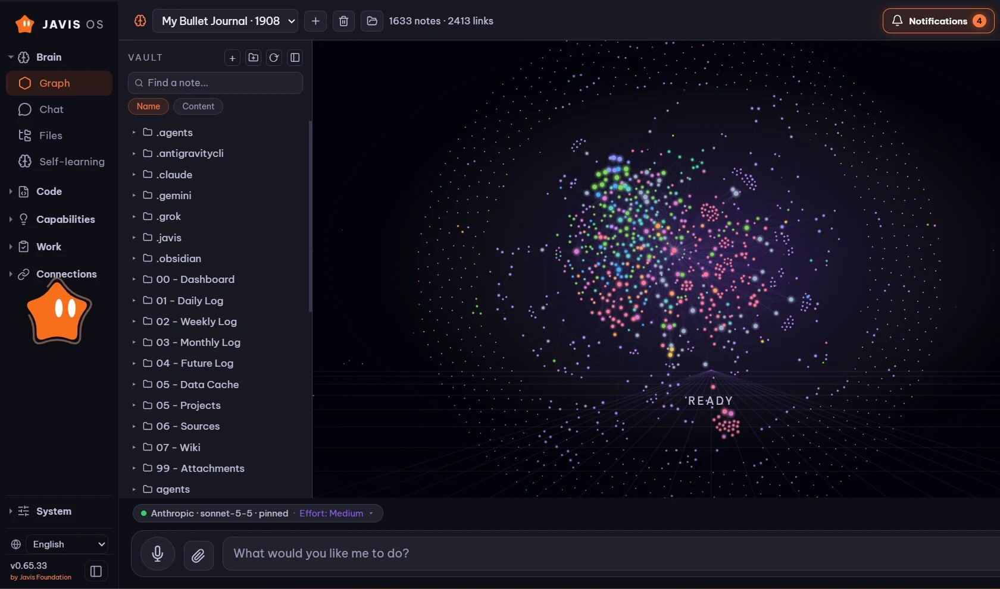
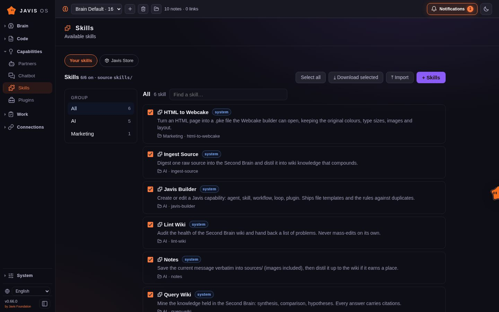
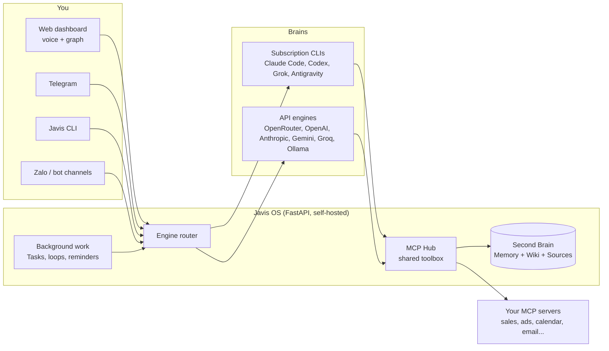

<!-- translated-from: README.md sha256:ee6b89779a60 -->
<div align="center">


# Javis OS

### 頭脳を差し替えられるセルフホスト型 AI エージェントと、毎日賢くなる Second Brain。

ノート PC でも小さな VPS でも動きます。声で話しかけられます。Claude、ChatGPT、Grok、Gemini など 12 のプロバイダーから好きなものをつなぎ、切り替えてもツールはすべてそのまま。あなたが寝ている間もバックグラウンドで働き続けます。

[](https://github.com/blogminhquy/javis-os/stargazers)
[](../../../LICENSE)
[](https://github.com/blogminhquy/javis-os/commits/main)
[](../../../requirements.txt)
[](https://github.com/blogminhquy/javis-os/pkgs/container/javis-os)
[](https://modelcontextprotocol.io)

[🇬🇧 English](../../../README.md) · [🇻🇳 Tiếng Việt](../vi/README.md) · [🇨🇳 简体中文](../zh/README.md) · [🇪🇸 Español](../es/README.md) · 🇯🇵 **日本語** · [🌍 翻訳に協力する](../../../CONTRIBUTING.md#translations)

[クイックスタート](#-クイックスタート) · [Javis を選ぶ理由](#-javis-を選ぶ理由) · [頭脳](#-12-の頭脳ひとつのツールキット) · [機能](#-機能) · [インストール](#-インストール) · [ドキュメント](../../../docs/en/README.md) · [支援](#-javis-os-を支援する)

<br>



</div>

> 🌍 このページは英語版 README の自動翻訳です。Javis 自体は、あなたが書いた言語でそのまま返答します。インターフェースは現在、英語とベトナム語で提供されています。詳しいドキュメントは英語版（[docs/en](../../../docs/en/README.md)）をご覧ください。翻訳の修正はいつでも歓迎します（[CONTRIBUTING](../../../CONTRIBUTING.md#translations)）。

---

## ⚡ クイックスタート

**いちばん簡単な方法：手元の AI にインストールさせる。** お使いのマシンの Claude Code か Codex にこのリポジトリのリンクを渡し、*「Javis OS をインストールして」* と頼んでください。必要なのはコマンドひとつだけです。

| マシン | コマンドひとつで全部インストール |
|---|---|
| **Linux / macOS** | `git clone https://github.com/blogminhquy/javis-os.git javis && cd javis && chmod +x install.sh && ./install.sh` |
| **Windows** | `git clone https://github.com/blogminhquy/javis-os.git javis; cd javis; powershell -ExecutionPolicy Bypass -File install.ps1` |
| **Docker** | `curl -fsSLO https://raw.githubusercontent.com/blogminhquy/javis-os/main/docker-compose.yml && docker compose up -d` |

あとは **http://localhost:7777** を開くだけです。インストーラーは Python、サブスクリプションで動く 4 つの CLI 頭脳（`claude`、`codex`、`agy`、`grok`）と `.env` をセットアップし、サーバーを起動します。各頭脳へのサインインは **ダッシュボードの Models ページ** で行えるので、もうコマンドを打つ必要はありません。

> [!NOTE]
> Javis の起動 **後に** CLI を追加でインストールした場合は、**Javis を再起動してください。** 実行中のプロセスは起動時の PATH を保持しているため、あとからインストールした CLI は見えません。

---

## 🤔 Javis を選ぶ理由

Javis OS はチャットボット **ではありません**。自分のマシンや VPS で動く **セルフホスト型のエージェント AI** です。ファイルを読み書きし、MCP 経由でツールを呼び出し、Skill を実行し、バックグラウンド作業をキューに積み、自分でスケジュールを組みます。これらすべてが **音声で操作できるダッシュボード** と、時間とともに知識を蓄積する **Second Brain**（メモリ + Wiki）の上にまとまっています。

| | 一般的なチャットボット | **Javis OS** |
|---|---|---|
| **頭脳** | ひとつのモデルに固定。メッセージごとに状態を持たない API 呼び出しが 1 回 | **差し替え可能**：12 のプロバイダー。どれもツール、MCP、Skill、セッションをフルに使え、Ollama 経由で自分のマシン上のモデルも動かせる |
| **記憶** | セッションが終わるたびに忘れる | あなたのことを覚え、会話のたびに厚みを増す **生きた Second Brain** |
| **データ** | でっち上げか、そもそも無い | つないだ接続（売上、広告、カレンダー、メール、メッセージ）からの **実際の数値** |
| **作業** | 答えたら待つだけ | 結果を報告してくれる **バックグラウンドの Loop、リマインダー、AI が運用するタスクキュー** |
| **インターフェース** | チャット欄ひとつ | ダッシュボード + ナレッジグラフ + **ハンズフリー音声** + Telegram + CLI |
| **デプロイ** | 誰かのクラウド | **セルフホスト**：ワンクリックの Hostinger、Docker、または任意の VPS |

> 💡 **設計思想：能力はモデルではなく Javis に宿る。** どの頭脳も、ひとつの共有接続ハブ（MCP Hub）を通じて同じツール一式を受け取ります。Claude から Gemini に切り替えても失うものはありません。例外はシェルアクセスだけで、これは CLI エンジンにしかありません。

---

## 🧠 12 の頭脳、ひとつのツールキット

頭脳は **Models** ページで選び、いつでも好きなときに変更できます。Javis は現在 **12 のプロバイダー** に対応しています。

| 頭脳 | 支払い方法 | シェル、Web、サブエージェント |
|---|---|---|
| **Claude Code** | お使いの Claude プラン、または Anthropic API キー | ✅ |
| **ChatGPT**（Codex 経由） | お使いの ChatGPT プラン | ✅ |
| **Grok Build** | お使いの SuperGrok または X Premium+ プラン | ✅ |
| **Antigravity CLI** | お使いの Google プラン（Antigravity IDE と同じモデル構成で、Claude も含む） | シェル ✅ |
| **OpenRouter** | API キー（ひとつのキーで数百のモデル） | Javis のツール経由 |
| **OpenAI API** · **Anthropic API** · **Google Gemini** · **Groq** | API キー | Javis のツール経由 |
| **Ollama Cloud** · **このマシン上の Ollama** | API キー、または自前のハードウェアなら無料 | Javis のツール経由 |
| **任意の OpenAI 互換エンドポイント** | そのエンドポイントが求めるもの | Javis のツール経由 |

どの頭脳も、接続済みの MCP サーバーを呼び出し、Brain を読み書きし、Skill を実行し、Kanban の作業をキューに積み、Agent、Workflow、Loop、リマインダーを作成できます。CLI エンジンはそれに加えて **シェルコマンドの実行**、**Web の取得と検索**、**並列サブエージェントの起動** ができます。

> [!WARNING]
> **サブスクリプションにバックグラウンド作業をさせる前に必ずお読みください。** Anthropic は Claude Pro/Max の対象を、Claude Code の **通常の個人利用** に限定しています。継続的なバックグラウンド実行（Loop、リマインダー、Kanban ジョブ、チャットボット）、VPS 上での実行、複数人での 1 アカウント共有はいずれもその範囲外で、実際にこれが原因で **アカウントが停止された** 例があります。Javis はあなたのログイントークンを読み取りません。本物の `claude` バイナリを実行しますが、だからといって 24 時間体制のバックグラウンド利用が正当になるわけではありません。安全を期すなら、Models ページで Claude Code を **API キー** で動かすよう設定するか、**バックグラウンド作業用モデル** を別のプロバイダーに向けてください。xAI のプランにも同じ注意が当てはまります。`server/claude_auth.py` を参照してください。

---

## ✨ 機能

<table>
<tr>
<td width="50%" valign="top">

### 🗣️ 話しかける
- **ハンズフリー音声**：話すと Javis が聞き取り、声で答えます（デフォルトは無料の Edge TTS、ほかに OpenAI と ElevenLabs も利用可能）。
- **チャットセッション** は保存、再開、全文検索ができます。長いセッションは途中で切られるのではなく、要約に圧縮されます。
- **Telegram、CLI、Web ダッシュボード** のどれからでも、同じ Javis と話せます。
- **どの言語でも**：Javis はあなたが書いた言語で返答します。インターフェースは英語とベトナム語で提供されています。

### 🧠 すべてを記憶する
- **Second Brain**：長期記憶、Wiki、生の Sources を備えた Markdown の Vault（Obsidian 互換）。
- `[[wikilink]]` でつながったノートの **ナレッジグラフ** を、オフラインでも動く明るいキャンバスに表示します。
- **自己学習**：会話のたびに Javis が記憶、Wiki の知識、Skill を抽出します。学習の 1 回 1 回が git コミットなので、**ワンタップで取り消せます**。
- **GitHub へのバックアップ**：すべての Brain をプライベートリポジトリと双方向に同期し、ノート PC と VPS で共有できます。

</td>
<td width="50%" valign="top">

### ⚙️ 寝ている間に働く
- **タスク（Kanban）**：目標を普段の言葉で渡すだけ。AI が仕様を書き、担当ワーカーを選び、バックグラウンドで実行し、例外があったときだけ呼び出します。
- **Loop とリマインダー**：一定間隔、時刻指定、cron 式で動くバックグラウンドジョブで、それぞれが自分の作業を検証します。
- **Agent と Workflow**：自分専用の記憶を持つ専門アシスタントを、検証付きの多段階 Workflow につなげられます。
- **チャットボット**：Agent を専用の Telegram や Zalo ボットとして顧客の前に立たせ、共有受信箱からいつでも対応を引き継げます。

### 🔌 何でもつなぐ
- **MCP 接続ストア**：サービスごとに複数アカウントを持て、3 段階の権限レベルを Javis が **強制** します。
- **Skill と Plugin**：フォルダを置くだけで、すべてのエンジン向けにノウハウ（Skill）やネイティブな Python ツール（Plugin）を追加できます。
- **画像生成**：すでにサインイン済みの ChatGPT プランで行います。
- **使用量の追跡**：日別、プロバイダー別のトークン数とコストを、あなたが入力した分と自動で動いた分に分けて表示します。

</td>
</tr>
</table>

<div align="center">


</div>

---

## 🏗️ 仕組み



- **バックエンド：** `server/` にある Python FastAPI。エンジン（`claude_sdk_engine.py`、`claude_cli.py`、`antigravity_cli.py`、`engine.py`、`aux_engine.py`）、ツール（`mcp_hub.py`、`mcp_store.py`、`plugins_host.py`）、バックグラウンド作業（`tasks.py`、`self_improve.py`、`reminders.py`、`learn.py`）、言語とロケール（`lang.py`、`lang_registry.py`、`localefmt.py`）で構成されています。
- **フロントエンド：** `dashboard/` にあるプレーンな HTML/CSS/JS。フレームワークもビルド工程もないので、小さな VPS でも軽く動きます。インターフェースの文字列は `dashboard/i18n/` にあります。
- **Second Brain：** `brains/<brain name>/` にある Markdown の Vault です。

---

## 🚀 インストール

> [!IMPORTANT]
> Javis はマシン上で **フル権限** を持つ AI 頭脳を動かします。公開環境（Docker、VPS、Hostinger）で動かす場合、Javis は **自動的にログインを必須にします**。アプリを開くとアカウント作成またはサインイン画面が表示され、パスワードなしでは誰も操作できません。

<details open>
<summary><b>方法 1：Hostinger Docker Manager（ドメイン + HTTPS、ワンクリック）</b></summary>

Hostinger VPS → **Docker Manager → Compose → URL** → Hostinger 用のファイルを貼り付けて **Deploy** を押します。

```
https://raw.githubusercontent.com/blogminhquy/javis-os/main/docker-compose.hostinger.yml
```

**Environment** 欄に必要なのは `DOMAIN_NAME`、`JAVIS_ADMIN_USER`、`JAVIS_ADMIN_PASSWORD` の 3 項目だけです。任意で `JAVIS_AUTO_UPDATE` も指定できます（`true` にすると Javis が毎日自動でアップデートします）。

Hostinger の Traefik が HTTPS 証明書を発行できるよう、`DOMAIN_NAME` を設定します。
- **無料のリンク**（ドメイン購入不要）：`DOMAIN_NAME=javis.<vps-hostname>.hstgr.cloud`（ホスト名は hPanel → VPS で確認できます。例：`javis.srv1562015.hstgr.cloud`）。
- **独自ドメイン：** `DOMAIN_NAME=example.com` とし、A レコードを VPS の IP に向けます。

証明書の発行を 1-3 分待ってから、`https://<DOMAIN_NAME>` を開きます。

**最初に一度だけ行う 3 つの手順：**
1. **GHCR イメージを Public にする：** GitHub → リポジトリ → **Packages** → `javis-os` → *Package settings* → Visibility = **Public**。
2. **管理者アカウントを作成する：** `JAVIS_ADMIN_USER` + `JAVIS_ADMIN_PASSWORD` を入力するか（推奨）、デプロイ直後にアプリを開いて自分で設定します。管理者が存在しない間は、最初にリンクを開いた人が作成できてしまいます。そのあと **2FA を有効にしてください**（[セキュリティとアカウント](../../../docs/en/14-security-and-accounts.md)）。
3. **Models** ページで **頭脳にサインインします**。

詳細とトラブルシューティング：[DEPLOY.en.md](../../../DEPLOY.en.md)。

</details>

<details>
<summary><b>方法 2：任意の VPS で Docker（clone 不要）</b></summary>

```bash
# Docker required (don't have it?  curl -fsSL https://get.docker.com | sh)
mkdir javis && cd javis
curl -fsSLO https://raw.githubusercontent.com/blogminhquy/javis-os/main/docker-compose.yml

docker compose run --rm javis claude auth login --claudeai   # sign in to Claude once (optional)
docker compose up -d                                          # pull the image and run
```

`http://<vps-ip>:7777` を開き、すぐに管理者のユーザー名とパスワード（8 文字以上）を設定します。または、環境変数に `JAVIS_ADMIN_USER` + `JAVIS_ADMIN_PASSWORD` をあらかじめ設定しておきます。そのあと 2FA を有効にしてください。

ドメインなしでリモートアクセスするには：`docker compose --profile tunnel up -d` を実行し、`docker compose logs tunnel | grep trycloudflare` で HTTPS のリンクが表示されます。

</details>

<details>
<summary><b>方法 3：Linux または macOS、Docker なし</b></summary>

```bash
git clone https://github.com/blogminhquy/javis-os.git javis && cd javis
chmod +x install.sh && ./install.sh
```

スクリプトが Python、Node、CLI 頭脳をインストールし、venv を作成し、起動時に立ち上がるサービスを登録して、アクセス先のアドレスを表示します。

🍎 **macOS でアプリのように開く：** `JAVIS OS.app`（または `Start JAVIS OS.command`）をダブルクリックします。ログイン時に起動するには：`./bin/javis-autostart.sh install`。詳細：[bin/README.md](../../../bin/README.md)。

</details>

<details>
<summary><b>方法 4：Windows（個人のマシン）</b></summary>

```powershell
git clone https://github.com/blogminhquy/javis-os.git javis; cd javis
powershell -ExecutionPolicy Bypass -File install.ps1
```

`install.ps1` は、Python、venv とライブラリ、サブスクリプションで動く 4 つの CLI 頭脳（`claude`、`codex`、`agy`、`grok`）、`.env`、ポート 7777 の解放、サーバーの起動までを一度に行います。最後に、どの頭脳が使える状態かを表で示します。`winget` がない場合は、先に Python 3.12（「Add python.exe to PATH」にチェック）と Node.js LTS を手動でインストールしてから、もう一度実行してください。

```
Run with a visible window (live log):  setup.bat
Run silently from then on:             start-javis.vbs   (log at server\javis.log)
Stop:                                  stop-javis.bat
Dashboard:                             http://localhost:7777
```

🪟 **アプリのように開く：** 初回の実行後は **`JAVIS OS.bat`** をダブルクリックします。サーバーがバックグラウンドで起動し、ダッシュボードが **専用のウィンドウ** で、タスクバーにも独立して表示されます。ログイン時に起動するには：`javis-autostart.bat install`（解除は `uninstall`）。

</details>

<details>
<summary><b>1 台の VPS で複数の Javis を動かす</b></summary>

Brain、設定、アカウントはインスタンスごとに完全に分離されます。インスタンス間で異なるのは `JAVIS_NAME`、`JAVIS_HOST_PORT`、`DOMAIN_NAME` の 3 つの値だけです。

- **Hostinger：** `docker-compose.hostinger.yml` を 2 つ目のスタックとしてもう一度デプロイし、この 3 項目を入力します。
- **自前で管理する VPS：** マシン全体で共有するプロキシ `docker-compose.proxy.yml` を一度だけ起動し、各インスタンスには `docker-compose.multi.yml` で専用のフォルダを用意します。プロキシが新しいインスタンスを検出し、SSL 証明書も自動で取得します。
- **ネイティブ：** `JAVIS_NAME=javis-shop JAVIS_PORT=7778 ./install.sh`。

手順の詳細：[DEPLOY.en.md](../../../DEPLOY.en.md)。

</details>

### 🎬 初回起動

Javis を開くと、セットアップウィザードがブラウザの言語で案内してくれます。

1. **管理者アカウント**：公開環境で動かす場合は必須です。部外者を締め出すためです。
2. **頭脳を選ぶ**：サブスクリプションで一度サインインするか、API キーを貼り付けます。Claude Code のカードには、サインイン済みのプランと Anthropic API キーを切り替える **「Runs on」** スイッチがあります。
3. **モデルを選ぶ**：あとでプロバイダーを切り替えても機能は失われません（CLI エンジンにしかないシェルコマンドを除きます）。
4. **接続をつなぐ**（任意）：**Connections**（接続）を開き、サービスを選んでキーを貼り付けるか QR コードを読み取ります。以降、Javis はそこから得た実際の数値をもとに報告します。

---

## 📖 Javis の使い方

左側のナビゲーションは、ページを **6 つのグループ** にまとめています。各ページのガイドは [docs/en/](../../../docs/en/README.md) にあります（英語）。

| グループ | ページ | ガイド |
|---|---|---|
| **Brain** | Graph、Chat、Files、Self-learning | [チャットと音声](../../../docs/en/02-chat-and-voice.md) · [ナレッジグラフ](../../../docs/en/03-knowledge-graph.md) · [セッション](../../../docs/en/04-sessions.md) · [ファイルマネージャー](../../../docs/en/05-file-manager.md) · [自己学習](../../../docs/en/22-self-learning.md) |
| **Code** | Terminal、Coding | [コードターミナル](../../../docs/en/27-code-terminal.md) |
| **Capabilities** | Partners（Agent と Workflow）、Chatbot、Skills、Plugins | [Agent と Workflow](../../../docs/en/07-agents-and-workflows.md) · [チャットボット](../../../docs/en/25-chatbots.md) · [顧客との会話](../../../docs/en/28-customer-conversations.md) · [Skill](../../../docs/en/06-skills.md) · [Plugin](../../../docs/en/20-plugins.md) |
| **Work** | Tasks、Scheduled | [タスク（Kanban）](../../../docs/en/21-kanban-work.md) · [定期ジョブとリマインダー](../../../docs/en/08-recurring-jobs.md) |
| **Connections** | Connections、Javis Store、Channels、Models | [接続とビジネスデータ](../../../docs/en/09-connections-and-business-data.md) · [Telegram](../../../docs/en/11-telegram.md) · [Zalo](../../../docs/en/12-zalo-agent-mcp.md) · [モデルとエンジン](../../../docs/en/10-models-and-engines.md) |
| **System** | Settings、Share links、Account | [はじめに](../../../docs/en/01-getting-started.md) · [セキュリティとアカウント](../../../docs/en/14-security-and-accounts.md) · [使用量とコスト](../../../docs/en/23-usage-and-cost.md) · [Javis CLI](../../../docs/en/24-cli.md) |

その他：[Second Brain：メモリ、Wiki と INGEST](../../../docs/en/13-second-brain.md) · [GitHub へのバックアップ](../../../docs/en/18-github-backup.md) · [ノート内のタスクと Dataview](../../../docs/en/19-tasks-and-dataview.md) · [ブランディングと独自ドメイン](../../../docs/en/15-branding-and-domains.md) · [トラブルシューティング](../../../docs/en/17-troubleshooting.md)

### 試してみたいこと

- **数字を聞く：** *「今日の売上は昨日と比べてどう？」* Javis が適切な接続を呼び出し、実際の数値と提案を添えて答えます。
- **知識を取り込む：** ファイルやノートを放り込むだけ。Javis が要約し、洞察を抽出して Wiki に書き込み、タスクを提案します。
- **バックグラウンド作業を任せる：** **Tasks** → **+ Assign goal** → *「今週の売上をまとめて、動きの鈍い在庫を見つけ、それを売り込むキャプションを 3 案書いて」*。AI が仕様を立てて実行し、結果を報告します。
- **予定を組む：** *「平日は毎朝 8:30 に広告予算を確認するようリマインドして」*。チャットからでも **Scheduled** ページからでも設定できます。
- **声を使う：** マイクを押して（またはハンズフリーをオンにして）話すと、Javis が声で答えます。

<div align="center">

<br><sub>スマートフォンでも動きます。ホーム画面に追加すれば、アプリのように開けます。</sub>
</div>

---

## ⚙️ 設定（`.env`）

どの行も空のままで Javis は動きます。`env.example` → `.env` にコピーし、必要なものを追加してください。各変数の説明付きの完全な一覧は [docs/en/16-env-configuration.md](../../../docs/en/16-env-configuration.md) にあります。

| 変数 | 意味 | デフォルト |
|---|---|---|
| `JAVIS_HOST` | 待ち受けアドレス。`127.0.0.1` = このマシンのみ、`0.0.0.0` = 公開 | `127.0.0.1` |
| `JAVIS_PORT` | ポート | `7777` |
| `JAVIS_REQUIRE_LOGIN` | `1`/`0` でログイン必須を強制的にオン／オフ（デフォルト：公開アドレスにバインドしたときはオン） | *（自動）* |
| `JAVIS_ADMIN_USER` / `JAVIS_ADMIN_PASSWORD` | デプロイ時に管理者を作成 | - |
| `JAVIS_ALLOWED_HOSTS` | 許可リストに追加するホスト名（CSRF と DNS リバインディング対策） | localhost + あなたのドメイン |
| `JAVIS_STATE_DIR` | 設定、セッション、暗号化キーの保存先 | `server/`（Docker：`/data/state`） |
| `BRAINS_DIR` | すべての Brain を収める親フォルダ | `brains/`（Docker：`/brains`） |
| `JAVIS_ENABLE_USER_PLUGINS` | `true` で自作 Plugin の実行を許可（サーバー内で本物の Python が動きます） | *（オフ）* |
| `TTS_VOICE` / `TTS_RATE` | Edge TTS の声と速度 | `en-US-EmmaMultilingualNeural` / `+5%` |

---

## 🔐 セキュリティ

- 公開サーバーでは、どの機能を使うにも **ログインが必須** です。頭脳がマシン上でフル権限を持って動くためです。
- **2FA（TOTP）**、ログイン試行回数の制限、8 文字以上のパスワード、HTTPS 下での `Secure` Cookie、30 日で期限切れになるセッション。
- **CSRF と DNS リバインディング対策**：不明なオリジンからの書き込みリクエストはすべて拒否されます。
- **シークレットは暗号化** して `settings.json` に保存されます（API キー、OAuth トークン、ボットトークン）。暗号化キーはマシンごとに異なります。
- **自作 Plugin はデフォルトでブロック** され、`JAVIS_ENABLE_USER_PLUGINS=true` を設定するまで動きません。
- **接続の権限はモデルではなくハブが強制します**：読み取り専用のアカウントを使って送信、支払い、公開を行うことはできません。

脆弱性を見つけた場合は、公開の Issue を立てるのではなく [SECURITY.md](../../../SECURITY.md) の手順に従ってください。

---

## 🔄 アップデート

アプリ内では **Settings → Updates → Update now** から。進行状況バーが表示され、新しいビルドが壊れていたときのためのロールバックボタンもあります。VPS では `cd javis && ./update.sh` を実行します（新しいイメージを取得して再起動します。ボリューム内のデータは保持されます）。

---

## 🩺 トラブルシューティング

| 症状 | 対処 |
|---|---|
| CLI はインストール済みなのに、Models ページに未インストールと表示される | **Javis を再起動してください**：実行中のプロセスは起動時の PATH を保持しています。 |
| ポート 7777 が使用中で、新しいビルドが起動しない | 先に古いプロセスを停止し（`stop-javis.bat`、または PID を kill）、もう一度起動します。 |
| Hostinger がイメージを取得できない | GHCR パッケージを **Public** にし、GitHub Action のビルド完了を待ちます。 |
| 頭脳がサインインしていないと言う | **Models** → そのプロバイダーのカード → サインイン。 |

詳しくは [docs/en/17-troubleshooting.md](../../../docs/en/17-troubleshooting.md) をご覧ください。

---

## 📂 リポジトリ構成

```
javis-os/
├── server/          # FastAPI backend: engines, connections, background work, channels, memory
├── dashboard/       # Frontend (plain JS, no build step)
│   └── i18n/        # Interface strings, one JSON file per language
├── brains/          # Every Second Brain (default: brains/Brain Default)
├── system/          # Ships with the app: bundled plugins, system skills, connection catalogue
├── docs/            # User guides (docs/en/ in English) and translations (docs/i18n/)
├── tests/           # Python + JS test suite (python tests/run.py)
├── website/         # Landing page
├── install.sh · install.ps1 · update.sh
├── Dockerfile · docker-compose*.yml
└── CLAUDE.md        # The system prompt Javis runs on
```

---

## 🌍 対応言語

| 対象 | 現在の対応言語 |
|---|---|
| **Javis の返答** | どの言語でも：あなたが書いた言語、または Settings で固定した言語で答えます |
| **ダッシュボードとサーバーのメッセージ** | 🇬🇧 English · 🇻🇳 Tiếng Việt。デバイスごとに設定され、言語を選ぶまでは各ブラウザの言語が使われます |
| **接続ストア、Plugin、新しい Brain の初期ファイル** | 🇬🇧 English · 🇻🇳 Tiếng Việt |
| **ドキュメント、README、[Web サイト](../../../website/index.html)** | 🇬🇧 English · 🇻🇳 Tiếng Việt |

言語の追加はコードの変更ではなく、データの変更です。`server/lang_registry.py` へのエントリ 1 件と `dashboard/i18n/<code>.json` 1 ファイル、必要に応じて `system/mcp-catalog.<code>.json` を追加するだけです。まだ翻訳されていない部分は英語で表示されます。協力していただける方は [CONTRIBUTING.en.md](../../../CONTRIBUTING.md#translations) をご覧ください。

---

## 🤝 コントリビュート

バグ報告、アイデア、翻訳、プルリクエストはどれも歓迎です。英語でもベトナム語でも構いません。

| まずはここから | 得られるもの |
|---|---|
| [CONTRIBUTING.md](../../../CONTRIBUTING.md) | 環境構築、テストの実行（`python tests/run.py`）、コード規約 |
| [ARCHITECTURE.md](../../../ARCHITECTURE.md) | 各部品の組み合わさり方と、サーバーモジュールの地図 |
| [docs/dev/GLOSSARY.md](../../../docs/dev/GLOSSARY.md) | コードベースはベトナム語で書かれています。`nhac_hen`（リマインダー）のような名前をここで読み解けます |
| [docs/dev/adding-a-language.md](../../../docs/dev/adding-a-language.md) | Javis をあなたの言語に翻訳する手順を、一歩ずつ解説 |
| [Issue テンプレート](https://github.com/blogminhquy/javis-os/issues/new/choose) | バグ報告、機能リクエスト、翻訳の申し出 |

[行動規範](../../../CODE_OF_CONDUCT.md) を守ってください。また、セキュリティ上の問題は [SECURITY.md](../../../SECURITY.md) の説明に従って非公開で報告してください。

Javis が役に立ったら、リポジトリに ⭐ を付けていただけると、ほかの人が見つけやすくなります。

[](https://star-history.com/#blogminhquy/javis-os&Date)

---

## 🙏 クレジット

- **頭脳：** [Claude Code](https://claude.com/claude-code) と [Claude Agent SDK](https://docs.claude.com/en/api/agent-sdk/overview)（Anthropic）、[Codex CLI](https://developers.openai.com/codex/cli)（OpenAI）、[Grok Build](https://x.ai)（xAI）、[Antigravity](https://antigravity.google)（Google）、さらに [OpenRouter](https://openrouter.ai)、OpenAI、[Google Gemini](https://ai.google.dev)、Anthropic、[Groq](https://groq.com)、[Ollama](https://ollama.com) の各 API。
- **ツールの標準規格：** [Model Context Protocol](https://modelcontextprotocol.io)。Javis の接続ストアは全面的にこれの上で動いています。
- Second Brain とデジタル Bullet Journal の手法。

## 📄 ライセンス

**MIT License** のオープンソースです。著作権表示を残すだけで、自由に使用、改変、再配布できます。[LICENSE](../../../LICENSE) を参照してください。

---

## ☕ Javis OS を支援する

Javis OS は無料のオープンソースですが、いまもコードを書き、テストサーバーの費用を払っているのは一人の開発者です。Javis があなたの仕事や生活の役に立っているなら、少額の寄付がバグ修正や新機能のための時間につながります。

- 🌍 **PayPal**：[paypal.me/quy01](https://paypal.me/quy01)
- 🏦 **MB Bank**（ベトナム）：`6636966369`
- 📱 **MoMo ウォレット**（ベトナム）：`0372752740`

寄付が難しくても、Javis を使うこと、フィードバックを送ること、プルリクエストを送ることも立派な支援です。

<div align="center">
<br>
<b><a href="https://minhquy.vn">Minh Quý</a></b> がベトナムで ☕ とともに制作
</div>
